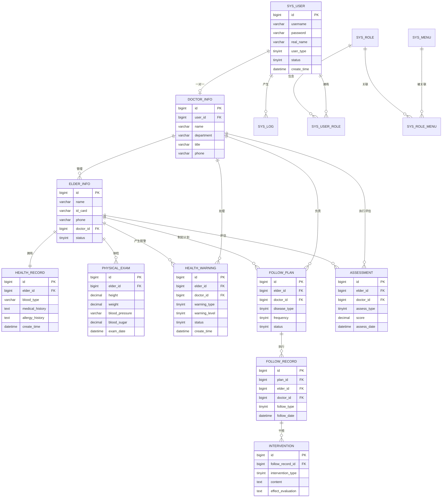

# 智慧医养大数据公共服务平台医生服务系统 数据库设计文档

## 1. ER 图



---

## 2. 数据表详细设计

---

### 2.1 系统用户表（sys_user）

| 字段名 | 数据类型 | 是否为空 | 默认值 | 说明 |
|--------|----------|----------|--------|------|
| id | BIGINT | NOT NULL | 自增 | 主键ID |
| username | VARCHAR(50) | NOT NULL | - | 用户名/工号 |
| password | VARCHAR(255) | NOT NULL | - | 密码（BCrypt加密） |
| real_name | VARCHAR(50) | NOT NULL | - | 真实姓名 |
| avatar | VARCHAR(255) | NULL | NULL | 头像URL |
| phone | VARCHAR(20) | NULL | NULL | 手机号 |
| email | VARCHAR(100) | NULL | NULL | 邮箱 |
| user_type | TINYINT | NOT NULL | 1 | 用户类型：1-管理员 2-医生 3-护士 |
| status | TINYINT | NOT NULL | 1 | 状态：0-禁用 1-启用 |
| last_login_time | DATETIME | NULL | NULL | 最后登录时间 |
| last_login_ip | VARCHAR(50) | NULL | NULL | 最后登录IP |
| create_time | DATETIME | NOT NULL | CURRENT_TIMESTAMP | 创建时间 |
| update_time | DATETIME | NOT NULL | CURRENT_TIMESTAMP | 更新时间 |
| deleted | TINYINT | NOT NULL | 0 | 逻辑删除：0-未删除 1-已删除 |

**主键**：`PRIMARY KEY (id)`

**索引**：
| 索引名 | 字段 | 类型 | 说明 |
|--------|------|------|------|
| uk_username | username | UNIQUE | 用户名唯一索引 |
| idx_phone | phone | NORMAL | 手机号查询索引 |
| idx_user_type | user_type | NORMAL | 用户类型索引 |
| idx_status | status | NORMAL | 状态索引 |

---

### 2.2 系统角色表（sys_role）

| 字段名 | 数据类型 | 是否为空 | 默认值 | 说明 |
|--------|----------|----------|--------|------|
| id | BIGINT | NOT NULL | 自增 | 主键ID |
| role_name | VARCHAR(50) | NOT NULL | - | 角色名称 |
| role_code | VARCHAR(50) | NOT NULL | - | 角色编码 |
| description | VARCHAR(255) | NULL | NULL | 角色描述 |
| status | TINYINT | NOT NULL | 1 | 状态：0-禁用 1-启用 |
| create_time | DATETIME | NOT NULL | CURRENT_TIMESTAMP | 创建时间 |
| update_time | DATETIME | NOT NULL | CURRENT_TIMESTAMP | 更新时间 |

**主键**：`PRIMARY KEY (id)`

**索引**：
| 索引名 | 字段 | 类型 |
|--------|------|------|
| uk_role_code | role_code | UNIQUE |

---

### 2.3 用户角色关联表（sys_user_role）

| 字段名 | 数据类型 | 是否为空 | 默认值 | 说明 |
|--------|----------|----------|--------|------|
| id | BIGINT | NOT NULL | 自增 | 主键ID |
| user_id | BIGINT | NOT NULL | - | 用户ID |
| role_id | BIGINT | NOT NULL | - | 角色ID |

**主键**：`PRIMARY KEY (id)`

**外键**：
- `FOREIGN KEY (user_id) REFERENCES sys_user(id)`
- `FOREIGN KEY (role_id) REFERENCES sys_role(id)`

**索引**：
| 索引名 | 字段 | 类型 |
|--------|------|------|
| uk_user_role | user_id, role_id | UNIQUE |

---

### 2.4 系统菜单表（sys_menu）

| 字段名 | 数据类型 | 是否为空 | 默认值 | 说明 |
|--------|----------|----------|--------|------|
| id | BIGINT | NOT NULL | 自增 | 主键ID |
| parent_id | BIGINT | NOT NULL | 0 | 父菜单ID，0为顶级 |
| menu_name | VARCHAR(50) | NOT NULL | - | 菜单名称 |
| menu_type | TINYINT | NOT NULL | - | 类型：1-目录 2-菜单 3-按钮 |
| path | VARCHAR(200) | NULL | NULL | 路由路径 |
| component | VARCHAR(200) | NULL | NULL | 组件路径 |
| permission | VARCHAR(100) | NULL | NULL | 权限标识 |
| icon | VARCHAR(100) | NULL | NULL | 图标 |
| sort_order | INT | NOT NULL | 0 | 排序 |
| status | TINYINT | NOT NULL | 1 | 状态：0-禁用 1-启用 |
| create_time | DATETIME | NOT NULL | CURRENT_TIMESTAMP | 创建时间 |

**主键**：`PRIMARY KEY (id)`

**索引**：
| 索引名 | 字段 | 类型 |
|--------|------|------|
| idx_parent_id | parent_id | NORMAL |

---

### 2.5 角色菜单关联表（sys_role_menu）

| 字段名 | 数据类型 | 是否为空 | 默认值 | 说明 |
|--------|----------|----------|--------|------|
| id | BIGINT | NOT NULL | 自增 | 主键ID |
| role_id | BIGINT | NOT NULL | - | 角色ID |
| menu_id | BIGINT | NOT NULL | - | 菜单ID |

**主键**：`PRIMARY KEY (id)`

**外键**：
- `FOREIGN KEY (role_id) REFERENCES sys_role(id)`
- `FOREIGN KEY (menu_id) REFERENCES sys_menu(id)`

**索引**：
| 索引名 | 字段 | 类型 |
|--------|------|------|
| uk_role_menu | role_id, menu_id | UNIQUE |

---

### 2.6 医生信息表（doctor_info）

| 字段名 | 数据类型 | 是否为空 | 默认值 | 说明 |
|--------|----------|----------|--------|------|
| id | BIGINT | NOT NULL | 自增 | 主键ID |
| user_id | BIGINT | NOT NULL | - | 关联系统用户ID |
| name | VARCHAR(50) | NOT NULL | - | 医生姓名 |
| gender | TINYINT | NOT NULL | - | 性别：1-男 2-女 |
| id_card | VARCHAR(18) | NULL | NULL | 身份证号 |
| phone | VARCHAR(20) | NOT NULL | - | 联系电话 |
| department | VARCHAR(100) | NOT NULL | - | 所属科室 |
| title | VARCHAR(50) | NULL | NULL | 职称 |
| specialty | VARCHAR(200) | NULL | NULL | 专业特长 |
| institution | VARCHAR(200) | NULL | NULL | 所属机构 |
| license_no | VARCHAR(50) | NULL | NULL | 执业证书编号 |
| service_area | VARCHAR(200) | NULL | NULL | 服务区域 |
| managed_count | INT | NOT NULL | 0 | 管理老人数量 |
| status | TINYINT | NOT NULL | 1 | 状态：0-离职 1-在职 |
| create_time | DATETIME | NOT NULL | CURRENT_TIMESTAMP | 创建时间 |
| update_time | DATETIME | NOT NULL | CURRENT_TIMESTAMP | 更新时间 |

**主键**：`PRIMARY KEY (id)`

**外键**：
- `FOREIGN KEY (user_id) REFERENCES sys_user(id)`

**索引**：
| 索引名 | 字段 | 类型 | 说明 |
|--------|------|------|------|
| uk_user_id | user_id | UNIQUE | 一个用户对应一个医生 |
| idx_department | department | NORMAL | 科室查询 |
| idx_institution | institution | NORMAL | 机构查询 |
| idx_name | name | NORMAL | 姓名查询 |

---

### 2.7 老人信息表（elder_info）

| 字段名 | 数据类型 | 是否为空 | 默认值 | 说明 |
|--------|----------|----------|--------|------|
| id | BIGINT | NOT NULL | 自增 | 主键ID |
| name | VARCHAR(50) | NOT NULL | - | 姓名 |
| gender | TINYINT | NOT NULL | - | 性别：1-男 2-女 |
| birth_date | DATE | NOT NULL | - | 出生日期 |
| age | INT | NULL | NULL | 年龄 |
| id_card | VARCHAR(18) | NOT NULL | - | 身份证号 |
| phone | VARCHAR(20) | NULL | NULL | 联系电话 |
| emergency_contact | VARCHAR(50) | NULL | NULL | 紧急联系人 |
| emergency_phone | VARCHAR(20) | NULL | NULL | 紧急联系人电话 |
| nation | VARCHAR(20) | NULL | NULL | 民族 |
| marital_status | TINYINT | NULL | NULL | 婚姻状况：1-未婚 2-已婚 3-丧偶 4-离异 |
| education | TINYINT | NULL | NULL | 文化程度：1-文盲 2-小学 3-初中 4-高中 5-大专及以上 |
| occupation | VARCHAR(50) | NULL | NULL | 职业 |
| address | VARCHAR(300) | NULL | NULL | 现住址 |
| household_address | VARCHAR(300) | NULL | NULL | 户籍地址 |
| community | VARCHAR(200) | NULL | NULL | 所属社区/养老机构 |
| medical_insurance_type | TINYINT | NULL | NULL | 医保类型：1-城镇职工 2-城乡居民 3-新农合 4-自费 |
| medical_insurance_no | VARCHAR(50) | NULL | NULL | 医保卡号 |
| doctor_id | BIGINT | NULL | NULL | 责任医生ID |
| account_status | TINYINT | NOT NULL | 1 | 账户状态：0-停用 1-启用 2-注销 |
| password | VARCHAR(255) | NULL | NULL | 账户密码（加密） |
| create_time | DATETIME | NOT NULL | CURRENT_TIMESTAMP | 创建时间 |
| update_time | DATETIME | NOT NULL | CURRENT_TIMESTAMP | 更新时间 |
| deleted | TINYINT | NOT NULL | 0 | 逻辑删除：0-未删除 1-已删除 |

**主键**：`PRIMARY KEY (id)`

**外键**：
- `FOREIGN KEY (doctor_id) REFERENCES doctor_info(id)`

**索引**：
| 索引名 | 字段 | 类型 | 说明 |
|--------|------|------|------|
| uk_id_card | id_card | UNIQUE | 身份证唯一索引 |
| idx_name | name | NORMAL | 姓名查询 |
| idx_phone | phone | NORMAL | 电话查询 |
| idx_doctor_id | doctor_id | NORMAL | 责任医生查询 |
| idx_community | community | NORMAL | 社区查询 |
| idx_account_status | account_status | NORMAL | 账户状态查询 |

---

### 2.8 健康档案表（health_record）

| 字段名 | 数据类型 | 是否为空 | 默认值 | 说明 |
|--------|----------|----------|--------|------|
| id | BIGINT | NOT NULL | 自增 | 主键ID |
| elder_id | BIGINT | NOT NULL | - | 老人ID |
| record_no | VARCHAR(50) | NOT NULL | - | 档案编号 |
| blood_type | VARCHAR(10) | NULL | NULL | 血型：A/B/AB/O |
| rh_type | VARCHAR(10) | NULL | NULL | RH血型：阳性/阴性 |
| height | DECIMAL(5,2) | NULL | NULL | 身高(cm) |
| weight | DECIMAL(5,2) | NULL | NULL | 体重(kg) |
| bmi | DECIMAL(4,2) | NULL | NULL | BMI指数 |
| medical_history | TEXT | NULL | NULL | 既往病史（JSON格式） |
| family_history | TEXT | NULL | NULL | 家族病史（JSON格式） |
| allergy_history | TEXT | NULL | NULL | 过敏史（JSON格式） |
| surgery_history | TEXT | NULL | NULL | 手术史（JSON格式） |
| current_medication | TEXT | NULL | NULL | 当前用药（JSON格式） |
| disability_status | VARCHAR(200) | NULL | NULL | 残疾情况 |
| living_ability | TINYINT | NULL | NULL | 生活自理能力：1-完全自理 2-部分自理 3-不能自理 |
| smoking_status | TINYINT | NULL | NULL | 吸烟状态：1-从不 2-已戒 3-吸烟 |
| drinking_status | TINYINT | NULL | NULL | 饮酒状态：1-从不 2-偶尔 3-经常 4-每天 |
| exercise_frequency | TINYINT | NULL | NULL | 运动频率：1-不运动 2-偶尔 3-经常 4-每天 |
| diet_habit | VARCHAR(200) | NULL | NULL | 饮食习惯 |
| sleep_quality | TINYINT | NULL | NULL | 睡眠质量：1-好 2-一般 3-差 |
| create_doctor_id | BIGINT | NOT NULL | - | 建档医生ID |
| create_time | DATETIME | NOT NULL | CURRENT_TIMESTAMP | 建档日期 |
| update_time | DATETIME | NOT NULL | CURRENT_TIMESTAMP | 更新时间 |

**主键**：`PRIMARY KEY (id)`

**外键**：
- `FOREIGN KEY (elder_id) REFERENCES elder_info(id)`
- `FOREIGN KEY (create_doctor_id) REFERENCES doctor_info(id)`

**索引**：
| 索引名 | 字段 | 类型 | 说明 |
|--------|------|------|------|
| uk_elder_id | elder_id | UNIQUE | 一人一档 |
| uk_record_no | record_no | UNIQUE | 档案编号唯一 |
| idx_create_doctor | create_doctor_id | NORMAL | 建档医生查询 |
| idx_create_time | create_time | NORMAL | 建档时间查询 |

---

### 2.9 体检记录表（physical_exam）

| 字段名 | 数据类型 | 是否为空 | 默认值 | 说明 |
|--------|----------|----------|--------|------|
| id | BIGINT | NOT NULL | 自增 | 主键ID |
| elder_id | BIGINT | NOT NULL | - | 老人ID |
| doctor_id | BIGINT | NOT NULL | - | 体检医生ID |
| exam_date | DATE | NOT NULL | - | 体检日期 |
| height | DECIMAL(5,2) | NULL | NULL | 身高(cm) |
| weight | DECIMAL(5,2) | NULL | NULL | 体重(kg) |
| bmi | DECIMAL(4,2) | NULL | NULL | BMI |
| systolic_pressure | INT | NULL | NULL | 收缩压(mmHg) |
| diastolic_pressure | INT | NULL | NULL | 舒张压(mmHg) |
| heart_rate | INT | NULL | NULL | 心率(次/分) |
| blood_sugar_fasting | DECIMAL(4,2) | NULL | NULL | 空腹血糖(mmol/L) |
| blood_sugar_random | DECIMAL(4,2) | NULL | NULL | 随机血糖(mmol/L) |
| hemoglobin | DECIMAL(5,2) | NULL | NULL | 血红蛋白(g/L) |
| wbc_count | DECIMAL(5,2) | NULL | NULL | 白细胞计数(×10⁹/L) |
| platelet_count | DECIMAL(5,2) | NULL | NULL | 血小板计数(×10⁹/L) |
| total_cholesterol | DECIMAL(4,2) | NULL | NULL | 总胆固醇(mmol/L) |
| triglyceride | DECIMAL(4,2) | NULL | NULL | 甘油三酯(mmol/L) |
| hdl | DECIMAL(4,2) | NULL | NULL | 高密度脂蛋白(mmol/L) |
| ldl | DECIMAL(4,2) | NULL | NULL | 低密度脂蛋白(mmol/L) |
| creatinine | DECIMAL(6,2) | NULL | NULL | 肌酐(μmol/L) |
| uric_acid | DECIMAL(6,2) | NULL | NULL | 尿酸(μmol/L) |
| alt | DECIMAL(6,2) | NULL | NULL | 谷丙转氨酶(U/L) |
| ast | DECIMAL(6,2) | NULL | NULL | 谷草转氨酶(U/L) |
| ecg_result | VARCHAR(500) | NULL | NULL | 心电图结果 |
| chest_xray_result | VARCHAR(500) | NULL | NULL | 胸片结果 |
| b_ultrasound_result | VARCHAR(500) | NULL | NULL | B超结果 |
| exam_summary | TEXT | NULL | NULL | 体检总结 |
| doctor_advice | TEXT | NULL | NULL | 医生建议 |
| abnormal_flag | TINYINT | NOT NULL | 0 | 是否有异常：0-正常 1-异常 |
| create_time | DATETIME | NOT NULL | CURRENT_TIMESTAMP | 创建时间 |

**主键**：`PRIMARY KEY (id)`

**外键**：
- `FOREIGN KEY (elder_id) REFERENCES elder_info(id)`
- `FOREIGN KEY (doctor_id) REFERENCES doctor_info(id)`

**索引**：
| 索引名 | 字段 | 类型 | 说明 |
|--------|------|------|------|
| idx_elder_id | elder_id | NORMAL | 老人查询 |
| idx_exam_date | exam_date | NORMAL | 体检日期查询 |
| idx_doctor_id | doctor_id | NORMAL | 医生查询 |
| idx_elder_date | elder_id, exam_date | NORMAL | 组合查询 |
| idx_abnormal | abnormal_flag | NORMAL | 异常筛选 |

---

### 2.10 健康预警表（health_warning）

| 字段名 | 数据类型 | 是否为空 | 默认值 | 说明 |
|--------|----------|----------|--------|------|
| id | BIGINT | NOT NULL | 自增 | 主键ID |
| elder_id | BIGINT | NOT NULL | - | 老人ID |
| doctor_id | BIGINT | NULL | NULL | 处理医生ID |
| warning_type | TINYINT | NOT NULL | - | 预警类型：1-血压 2-血糖 3-心率 4-体温 5-用药 6-复诊 7-其他 |
| warning_level | TINYINT | NOT NULL | - | 预警等级：1-黄色 2-橙色 3-红色 |
| warning_title | VARCHAR(200) | NOT NULL | - | 预警标题 |
| warning_content | TEXT | NOT NULL | - | 预警内容描述 |
| warning_value | VARCHAR(100) | NULL | NULL | 触发预警的指标值 |
| threshold_value | VARCHAR(100) | NULL | NULL | 预警阈值 |
| source_type | TINYINT | NULL | NULL | 数据来源：1-体检 2-设备监测 3-随访 4-手动录入 |
| source_id | BIGINT | NULL | NULL | 来源数据ID |
| status | TINYINT | NOT NULL | 0 | 状态：0-待处理 1-处理中 2-已处理 3-已忽略 |
| handle_time | DATETIME | NULL | NULL | 处理时间 |
| handle_result | TEXT | NULL | NULL | 处理结果 |
| handle_measures | VARCHAR(500) | NULL | NULL | 处理措施 |
| create_time | DATETIME | NOT NULL | CURRENT_TIMESTAMP | 预警生成时间 |
| update_time | DATETIME | NOT NULL | CURRENT_TIMESTAMP | 更新时间 |

**主键**：`PRIMARY KEY (id)`

**外键**：
- `FOREIGN KEY (elder_id) REFERENCES elder_info(id)`
- `FOREIGN KEY (doctor_id) REFERENCES doctor_info(id)`

**索引**：
| 索引名 | 字段 | 类型 | 说明 |
|--------|------|------|------|
| idx_elder_id | elder_id | NORMAL | 老人查询 |
| idx_doctor_id | doctor_id | NORMAL | 医生查询 |
| idx_status | status | NORMAL | 状态筛选 |
| idx_warning_level | warning_level | NORMAL | 预警等级筛选 |
| idx_warning_type | warning_type | NORMAL | 预警类型筛选 |
| idx_create_time | create_time | NORMAL | 时间查询 |
| idx_elder_status | elder_id, status | NORMAL | 组合查询 |

---

### 2.11 预警规则配置表（warning_rule）

| 字段名 | 数据类型 | 是否为空 | 默认值 | 说明 |
|--------|----------|----------|--------|------|
| id | BIGINT | NOT NULL | 自增 | 主键ID |
| rule_name | VARCHAR(100) | NOT NULL | - | 规则名称 |
| warning_type | TINYINT | NOT NULL | - | 预警类型 |
| warning_level | TINYINT | NOT NULL | - | 预警等级 |
| indicator_code | VARCHAR(50) | NOT NULL | - | 指标编码 |
| indicator_name | VARCHAR(100) | NOT NULL | - | 指标名称 |
| operator | VARCHAR(10) | NOT NULL | - | 比较运算符：>、<、>=、<=、=、between |
| threshold_min | DECIMAL(10,2) | NULL | NULL | 阈值下限 |
| threshold_max | DECIMAL(10,2) | NULL | NULL | 阈值上限 |
| unit | VARCHAR(20) | NULL | NULL | 单位 |
| description | VARCHAR(500) | NULL | NULL | 规则描述 |
| status | TINYINT | NOT NULL | 1 | 状态：0-禁用 1-启用 |
| create_time | DATETIME | NOT NULL | CURRENT_TIMESTAMP | 创建时间 |
| update_time | DATETIME | NOT NULL | CURRENT_TIMESTAMP | 更新时间 |

**主键**：`PRIMARY KEY (id)`

**索引**：
| 索引名 | 字段 | 类型 |
|--------|------|------|
| idx_warning_type | warning_type | NORMAL |
| idx_indicator_code | indicator_code | NORMAL |
| idx_status | status | NORMAL |

---

### 2.12 随访计划表（follow_plan）

| 字段名 | 数据类型 | 是否为空 | 默认值 | 说明 |
|--------|----------|----------|--------|------|
| id | BIGINT | NOT NULL | 自增 | 主键ID |
| elder_id | BIGINT | NOT NULL | - | 老人ID |
| doctor_id | BIGINT | NOT NULL | - | 责任医生ID |
| plan_name | VARCHAR(200) | NOT NULL | - | 计划名称 |
| disease_type | TINYINT | NOT NULL | - | 病种类型：1-高血压 2-糖尿病 3-精神障碍 4-冠心病 5-脑卒中 6-老年人常规 7-其他 |
| frequency_type | TINYINT | NOT NULL | - | 频次类型：1-每周 2-每月 3-每季度 4-每半年 5-每年 |
| frequency_count | INT | NOT NULL | 1 | 每周期随访次数 |
| start_date | DATE | NOT NULL | - | 计划开始日期 |
| end_date | DATE | NULL | NULL | 计划结束日期 |
| next_follow_date | DATE | NULL | NULL | 下次随访日期 |
| total_count | INT | NOT NULL | 0 | 计划总次数 |
| completed_count | INT | NOT NULL | 0 | 已完成次数 |
| status | TINYINT | NOT NULL | 1 | 状态：0-暂停 1-进行中 2-已完成 3-已终止 |
| remark | VARCHAR(500) | NULL | NULL | 备注 |
| create_time | DATETIME | NOT NULL | CURRENT_TIMESTAMP | 创建时间 |
| update_time | DATETIME | NOT NULL | CURRENT_TIMESTAMP | 更新时间 |

**主键**：`PRIMARY KEY (id)`

**外键**：
- `FOREIGN KEY (elder_id) REFERENCES elder_info(id)`
- `FOREIGN KEY (doctor_id) REFERENCES doctor_info(id)`

**索引**：
| 索引名 | 字段 | 类型 | 说明 |
|--------|------|------|------|
| idx_elder_id | elder_id | NORMAL | 老人查询 |
| idx_doctor_id | doctor_id | NORMAL | 医生查询 |
| idx_disease_type | disease_type | NORMAL | 病种查询 |
| idx_status | status | NORMAL | 状态查询 |
| idx_next_follow | next_follow_date | NORMAL | 下次随访日期查询 |
| idx_doctor_status | doctor_id, status | NORMAL | 医生待办查询 |

---

### 2.13 随访记录表（follow_record）

| 字段名 | 数据类型 | 是否为空 | 默认值 | 说明 |
|--------|----------|----------|--------|------|
| id | BIGINT | NOT NULL | 自增 | 主键ID |
| plan_id | BIGINT | NOT NULL | - | 随访计划ID |
| elder_id | BIGINT | NOT NULL | - | 老人ID |
| doctor_id | BIGINT | NOT NULL | - | 随访医生ID |
| follow_date | DATETIME | NOT NULL | - | 随访日期 |
| follow_type | TINYINT | NOT NULL | - | 随访方式：1-门诊 2-电话 3-上门 4-远程视频 |
| disease_type | TINYINT | NOT NULL | - | 病种类型 |
| symptom_desc | TEXT | NULL | NULL | 症状描述 |
| systolic_pressure | INT | NULL | NULL | 收缩压(mmHg) |
| diastolic_pressure | INT | NULL | NULL | 舒张压(mmHg) |
| heart_rate | INT | NULL | NULL | 心率 |
| blood_sugar_fasting | DECIMAL(4,2) | NULL | NULL | 空腹血糖 |
| blood_sugar_random | DECIMAL(4,2) | NULL | NULL | 随机血糖 |
| weight | DECIMAL(5,2) | NULL | NULL | 体重(kg) |
| body_temperature | DECIMAL(3,1) | NULL | NULL | 体温(℃) |
| medication_compliance | TINYINT | NULL | NULL | 服药依从性：1-规律 2-间断 3-不服药 |
| current_medication | TEXT | NULL | NULL | 当前用药情况 |
| adverse_reaction | VARCHAR(500) | NULL | NULL | 药物不良反应 |
| smoking_status | TINYINT | NULL | NULL | 吸烟情况 |
| drinking_status | TINYINT | NULL | NULL | 饮酒情况 |
| exercise_status | TINYINT | NULL | NULL | 运动情况 |
| diet_status | VARCHAR(200) | NULL | NULL | 饮食情况 |
| psychological_status | TINYINT | NULL | NULL | 心理状态：1-良好 2-一般 3-较差 |
| classification | TINYINT | NULL | NULL | 随访分类（针对高血压）：1-一级 2-二级 3-三级 |
| follow_result | TEXT | NULL | NULL | 随访结论 |
| next_follow_date | DATE | NULL | NULL | 下次随访日期 |
| is_overdue | TINYINT | NOT NULL | 0 | 是否逾期：0-否 1-是 |
| remark | VARCHAR(500) | NULL | NULL | 备注 |
| create_time | DATETIME | NOT NULL | CURRENT_TIMESTAMP | 创建时间 |
| update_time | DATETIME | NOT NULL | CURRENT_TIMESTAMP | 更新时间 |

**主键**：`PRIMARY KEY (id)`

**外键**：
- `FOREIGN KEY (plan_id) REFERENCES follow_plan(id)`
- `FOREIGN KEY (elder_id) REFERENCES elder_info(id)`
- `FOREIGN KEY (doctor_id) REFERENCES doctor_info(id)`

**索引**：
| 索引名 | 字段 | 类型 | 说明 |
|--------|------|------|------|
| idx_plan_id | plan_id | NORMAL | 计划查询 |
| idx_elder_id | elder_id | NORMAL | 老人查询 |
| idx_doctor_id | doctor_id | NORMAL | 医生查询 |
| idx_follow_date | follow_date | NORMAL | 随访日期查询 |
| idx_disease_type | disease_type | NORMAL | 病种查询 |
| idx_elder_date | elder_id, follow_date | NORMAL | 组合查询 |
| idx_is_overdue | is_overdue | NORMAL | 逾期筛选 |

---

### 2.14 随访干预记录表（intervention_record）

| 字段名 | 数据类型 | 是否为空 | 默认值 | 说明 |
|--------|----------|----------|--------|------|
| id | BIGINT | NOT NULL | 自增 | 主键ID |
| follow_record_id | BIGINT | NOT NULL | - | 随访记录ID |
| elder_id | BIGINT | NOT NULL | - | 老人ID |
| doctor_id | BIGINT | NOT NULL | - | 干预医生ID |
| intervention_type | TINYINT | NOT NULL | - | 干预类型：1-药物干预 2-饮食指导 3-运动处方 4-心理疏导 5-转诊 6-健康教育 7-其他 |
| intervention_date | DATETIME | NOT NULL | - | 干预日期 |
| intervention_content | TEXT | NOT NULL | - | 干预内容详情 |
| medication_adjust | TEXT | NULL | NULL | 药物调整内容（JSON格式） |
| diet_guidance | VARCHAR(500) | NULL | NULL | 饮食指导内容 |
| exercise_guidance | VARCHAR(500) | NULL | NULL | 运动指导内容 |
| health_education | VARCHAR(500) | NULL | NULL | 健康宣教内容 |
| referral_hospital | VARCHAR(200) | NULL | NULL | 转诊医院 |
| referral_department | VARCHAR(100) | NULL | NULL | 转诊科室 |
| referral_reason | VARCHAR(500) | NULL | NULL | 转诊原因 |
| target_goal | VARCHAR(500) | NULL | NULL | 干预目标 |
| expected_effect | VARCHAR(500) | NULL | NULL | 预期效果 |
| actual_effect | TEXT | NULL | NULL | 实际效果 |
| effect_evaluation | TINYINT | NULL | NULL | 效果评价：1-显著 2-有效 3-一般 4-无效 |
| next_plan | VARCHAR(500) | NULL | NULL | 后续计划 |
| create_time | DATETIME | NOT NULL | CURRENT_TIMESTAMP | 创建时间 |
| update_time | DATETIME | NOT NULL | CURRENT_TIMESTAMP | 更新时间 |

**主键**：`PRIMARY KEY (id)`

**外键**：
- `FOREIGN KEY (follow_record_id) REFERENCES follow_record(id)`
- `FOREIGN KEY (elder_id) REFERENCES elder_info(id)`
- `FOREIGN KEY (doctor_id) REFERENCES doctor_info(id)`

**索引**：
| 索引名 | 字段 | 类型 | 说明 |
|--------|------|------|------|
| idx_follow_record_id | follow_record_id | NORMAL | 随访记录查询 |
| idx_elder_id | elder_id | NORMAL | 老人查询 |
| idx_doctor_id | doctor_id | NORMAL | 医生查询 |
| idx_intervention_type | intervention_type | NORMAL | 干预类型查询 |
| idx_intervention_date | intervention_date | NORMAL | 干预日期查询 |
| idx_effect_evaluation | effect_evaluation | NORMAL | 效果评价筛选 |

---

### 2.15 健康评估记录表（assessment_record）

| 字段名 | 数据类型 | 是否为空 | 默认值 | 说明 |
|--------|----------|----------|--------|------|
| id | BIGINT | NOT NULL | 自增 | 主键ID |
| elder_id | BIGINT | NOT NULL | - | 老人ID |
| doctor_id | BIGINT | NOT NULL | - | 评估医生ID |
| assess_type | TINYINT | NOT NULL | - | 评估类型：1-日常生活能力 2-认知功能 3-情绪心理 4-营养状况 5-跌倒风险 6-压疮风险 7-疼痛评估 8-社会功能 9-综合评估 |
| scale_name | VARCHAR(100) | NOT NULL | - | 量表名称 |
| scale_code | VARCHAR(50) | NOT NULL | - | 量表编码 |
| assess_date | DATETIME | NOT NULL | - | 评估日期 |
| total_score | DECIMAL(6,2) | NOT NULL | - | 总评分 |
| max_score | DECIMAL(6,2) | NULL | NULL | 量表满分 |
| result_level | TINYINT | NULL | NULL | 评估等级：1-正常 2-轻度 3-中度 4-重度 |
| result_desc | VARCHAR(500) | NULL | NULL | 评估结论描述 |
| detail_scores | TEXT | NULL | NULL | 各项明细评分（JSON格式） |
| assessment_suggestion | TEXT | NULL | NULL | 评估建议 |
| next_assess_date | DATE | NULL | NULL | 下次评估日期 |
| remark | VARCHAR(500) | NULL | NULL | 备注 |
| create_time | DATETIME | NOT NULL | CURRENT_TIMESTAMP | 创建时间 |
| update_time | DATETIME | NOT NULL | CURRENT_TIMESTAMP | 更新时间 |

**主键**：`PRIMARY KEY (id)`

**外键**：
- `FOREIGN KEY (elder_id) REFERENCES elder_info(id)`
- `FOREIGN KEY (doctor_id) REFERENCES doctor_info(id)`

**索引**：
| 索引名 | 字段 | 类型 | 说明 |
|--------|------|------|------|
| idx_elder_id | elder_id | NORMAL | 老人查询 |
| idx_doctor_id | doctor_id | NORMAL | 医生查询 |
| idx_assess_type | assess_type | NORMAL | 评估类型查询 |
| idx_assess_date | assess_date | NORMAL | 评估日期查询 |
| idx_result_level | result_level | NORMAL | 评估等级筛选 |
| idx_elder_type | elder_id, assess_type | NORMAL | 组合查询 |

---

### 2.16 评估量表模板表（assessment_scale）

| 字段名 | 数据类型 | 是否为空 | 默认值 | 说明 |
|--------|----------|----------|--------|------|
| id | BIGINT | NOT NULL | 自增 | 主键ID |
| scale_code | VARCHAR(50) | NOT NULL | - | 量表编码 |
| scale_name | VARCHAR(100) | NOT NULL | - | 量表名称 |
| assess_type | TINYINT | NOT NULL | - | 评估类型 |
| description | VARCHAR(500) | NULL | NULL | 量表描述 |
| total_score | DECIMAL(6,2) | NOT NULL | - | 量表满分 |
| items | TEXT | NOT NULL | - | 量表题目（JSON格式） |
| scoring_rules | TEXT | NULL | NULL | 评分规则（JSON格式） |
| level_rules | TEXT | NULL | NULL | 等级划分规则（JSON格式） |
| status | TINYINT | NOT NULL | 1 | 状态：0-禁用 1-启用 |
| create_time | DATETIME | NOT NULL | CURRENT_TIMESTAMP | 创建时间 |
| update_time | DATETIME | NOT NULL | CURRENT_TIMESTAMP | 更新时间 |

**主键**：`PRIMARY KEY (id)`

**索引**：
| 索引名 | 字段 | 类型 |
|--------|------|------|
| uk_scale_code | scale_code | UNIQUE |
| idx_assess_type | assess_type | NORMAL |
| idx_status | status | NORMAL |

---

### 2.17 系统操作日志表（sys_log）

| 字段名 | 数据类型 | 是否为空 | 默认值 | 说明 |
|--------|----------|----------|--------|------|
| id | BIGINT | NOT NULL | 自增 | 主键ID |
| user_id | BIGINT | NULL | NULL | 操作用户ID |
| username | VARCHAR(50) | NULL | NULL | 操作用户名 |
| operation | VARCHAR(200) | NOT NULL | - | 操作描述 |
| method | VARCHAR(200) | NULL | NULL | 请求方法 |
| request_url | VARCHAR(500) | NULL | NULL | 请求URL |
| request_params | TEXT | NULL | NULL | 请求参数 |
| response_result | TEXT | NULL | NULL | 响应结果 |
| ip_address | VARCHAR(50) | NULL | NULL | 操作IP |
| user_agent | VARCHAR(500) | NULL | NULL | 浏览器标识 |
| execute_time | BIGINT | NULL | NULL | 执行时长(ms) |
| status | TINYINT | NOT NULL | 1 | 状态：0-失败 1-成功 |
| error_msg | TEXT | NULL | NULL | 错误信息 |
| log_type | TINYINT | NOT NULL | 1 | 日志类型：1-操作日志 2-登录日志 3-异常日志 |
| create_time | DATETIME | NOT NULL | CURRENT_TIMESTAMP | 操作时间 |

**主键**：`PRIMARY KEY (id)`

**索引**：
| 索引名 | 字段 | 类型 | 说明 |
|--------|------|------|------|
| idx_user_id | user_id | NORMAL | 用户查询 |
| idx_create_time | create_time | NORMAL | 时间查询 |
| idx_log_type | log_type | NORMAL | 日志类型查询 |
| idx_status | status | NORMAL | 状态查询 |

---

### 2.18 系统消息通知表（sys_notification）

| 字段名 | 数据类型 | 是否为空 | 默认值 | 说明 |
|--------|----------|----------|--------|------|
| id | BIGINT | NOT NULL | 自增 | 主键ID |
| user_id | BIGINT | NOT NULL | - | 接收用户ID |
| title | VARCHAR(200) | NOT NULL | - | 通知标题 |
| content | TEXT | NOT NULL | - | 通知内容 |
| notify_type | TINYINT | NOT NULL | - | 通知类型：1-预警通知 2-随访提醒 3-系统通知 4-评估提醒 |
| biz_type | VARCHAR(50) | NULL | NULL | 关联业务类型 |
| biz_id | BIGINT | NULL | NULL | 关联业务ID |
| is_read | TINYINT | NOT NULL | 0 | 是否已读：0-未读 1-已读 |
| read_time | DATETIME | NULL | NULL | 阅读时间 |
| create_time | DATETIME | NOT NULL | CURRENT_TIMESTAMP | 创建时间 |

**主键**：`PRIMARY KEY (id)`

**索引**：
| 索引名 | 字段 | 类型 | 说明 |
|--------|------|------|------|
| idx_user_id | user_id | NORMAL | 用户查询 |
| idx_is_read | is_read | NORMAL | 已读状态查询 |
| idx_user_read | user_id, is_read | NORMAL | 组合查询 |
| idx_notify_type | notify_type | NORMAL | 通知类型查询 |
| idx_create_time | create_time | NORMAL | 时间查询 |

---

## 3. 数据表关系总览

### 3.1 主外键关系汇总

| 子表 | 外键字段 | 父表 | 主键字段 | 关系 | 说明 |
|------|----------|------|----------|------|------|
| sys_user_role | user_id | sys_user | id | N:1 | 用户角色关联 |
| sys_user_role | role_id | sys_role | id | N:1 | 角色关联 |
| sys_role_menu | role_id | sys_role | id | N:1 | 角色菜单关联 |
| sys_role_menu | menu_id | sys_menu | id | N:1 | 菜单关联 |
| doctor_info | user_id | sys_user | id | 1:1 | 医生用户关联 |
| elder_info | doctor_id | doctor_info | id | N:1 | 老人责任医生 |
| health_record | elder_id | elder_info | id | 1:1 | 老人健康档案 |
| health_record | create_doctor_id | doctor_info | id | N:1 | 建档医生 |
| physical_exam | elder_id | elder_info | id | N:1 | 老人体检 |
| physical_exam | doctor_id | doctor_info | id | N:1 | 体检医生 |
| health_warning | elder_id | elder_info | id | N:1 | 老人预警 |
| health_warning | doctor_id | doctor_info | id | N:1 | 处理医生 |
| follow_plan | elder_id | elder_info | id | N:1 | 老人随访计划 |
| follow_plan | doctor_id | doctor_info | id | N:1 | 负责医生 |
| follow_record | plan_id | follow_plan | id | N:1 | 所属计划 |
| follow_record | elder_id | elder_info | id | N:1 | 随访老人 |
| follow_record | doctor_id | doctor_info | id | N:1 | 随访医生 |
| intervention_record | follow_record_id | follow_record | id | N:1 | 干预随访 |
| intervention_record | elder_id | elder_info | id | N:1 | 干预老人 |
| intervention_record | doctor_id | doctor_info | id | N:1 | 干预医生 |
| assessment_record | elder_id | elder_info | id | N:1 | 评估老人 |
| assessment_record | doctor_id | doctor_info | id | N:1 | 评估医生 |
| sys_log | user_id | sys_user | id | N:1 | 操作用户 |
| sys_notification | user_id | sys_user | id | N:1 | 接收用户 |

### 3.2 核心实体关系说明

```
sys_user (1) ←→ (1) doctor_info         # 用户与医生一对一
doctor_info (1) ←→ (N) elder_info        # 医生管理多个老人
elder_info (1) ←→ (1) health_record      # 老人与档案一对一
elder_info (1) ←→ (N) physical_exam      # 老人多次体检
elder_info (1) ←→ (N) health_warning     # 老人多条预警
elder_info (1) ←→ (N) follow_plan        # 老人多个随访计划
follow_plan (1) ←→ (N) follow_record     # 计划包含多条随访记录
follow_record (1) ←→ (N) intervention_record  # 随访产生多条干预
elder_info (1) ←→ (N) assessment_record  # 老人多次评估
```

---

## 4. 数据字典

### 4.1 通用枚举定义

| 枚举名 | 值 | 说明 |
|--------|-----|------|
| 性别 | 1-男, 2-女 | |
| 通用状态 | 0-禁用, 1-启用 | |
| 逻辑删除 | 0-未删除, 1-已删除 | |
| 用户类型 | 1-管理员, 2-医生, 3-护士 | |
| 账户状态 | 0-停用, 1-启用, 2-注销 | |

### 4.2 业务枚举定义

| 枚举名 | 值 | 说明 |
|--------|-----|------|
| 预警类型 | 1-血压, 2-血糖, 3-心率, 4-体温, 5-用药, 6-复诊, 7-其他 | |
| 预警等级 | 1-黄色(一般), 2-橙色(较重), 3-红色(严重) | |
| 预警状态 | 0-待处理, 1-处理中, 2-已处理, 3-已忽略 | |
| 病种类型 | 1-高血压, 2-糖尿病, 3-精神障碍, 4-冠心病, 5-脑卒中, 6-老年人常规, 7-其他 | |
| 随访方式 | 1-门诊, 2-电话, 3-上门, 4-远程视频 | |
| 随访计划状态 | 0-暂停, 1-进行中, 2-已完成, 3-已终止 | |
| 频次类型 | 1-每周, 2-每月, 3-每季度, 4-每半年, 5-每年 | |
| 干预类型 | 1-药物干预, 2-饮食指导, 3-运动处方, 4-心理疏导, 5-转诊, 6-健康教育, 7-其他 | |
| 干预效果 | 1-显著, 2-有效, 3-一般, 4-无效 | |
| 评估类型 | 1-日常生活能力, 2-认知功能, 3-情绪心理, 4-营养状况, 5-跌倒风险, 6-压疮风险, 7-疼痛评估, 8-社会功能, 9-综合评估 | |
| 评估等级 | 1-正常, 2-轻度, 3-中度, 4-重度 | |
| 服药依从性 | 1-规律, 2-间断, 3-不服药 | |
| 通知类型 | 1-预警通知, 2-随访提醒, 3-系统通知, 4-评估提醒 | |

---

## 5. 索引设计原则

1. **主键索引**：所有表使用自增BIGINT作为主键
2. **唯一索引**：对业务唯一性字段（用户名、身份证号、档案编号等）建立唯一索引
3. **外键索引**：所有外键字段建立普通索引，加速关联查询
4. **组合索引**：针对常用组合查询条件建立组合索引，遵循最左匹配原则
5. **时间索引**：对时间字段建立索引，支持按时间范围查询和排序
6. **状态索引**：对状态字段建立索引，支持按状态筛选

---

## 6. 设计规范

### 6.1 命名规范

- 表名：小写字母 + 下划线分隔，如 `elder_info`
- 字段名：小写字母 + 下划线分隔（驼峰映射），如 `create_time`
- 索引名：`idx_` + 字段名（普通索引）/ `uk_` + 字段名（唯一索引）
- 外键名：`fk_` + 表名 + `_` + 字段名

### 6.2 通用字段

所有业务表包含以下通用字段：
- `id`：主键，BIGINT 自增
- `create_time`：创建时间，DATETIME
- `update_time`：更新时间，DATETIME
- `deleted`：逻辑删除标识（按需添加）

### 6.3 数据安全

- 密码字段使用BCrypt加密存储
- 身份证号等敏感信息加密存储（AES）
- 所有删除操作使用逻辑删除
- 关键操作记录审计日志

---

**文档版本**：V1.0  
**编写日期**：2026年6月  
**编写人**：数据库设计师  
**审核人**：项目经理  
**状态**：初稿
