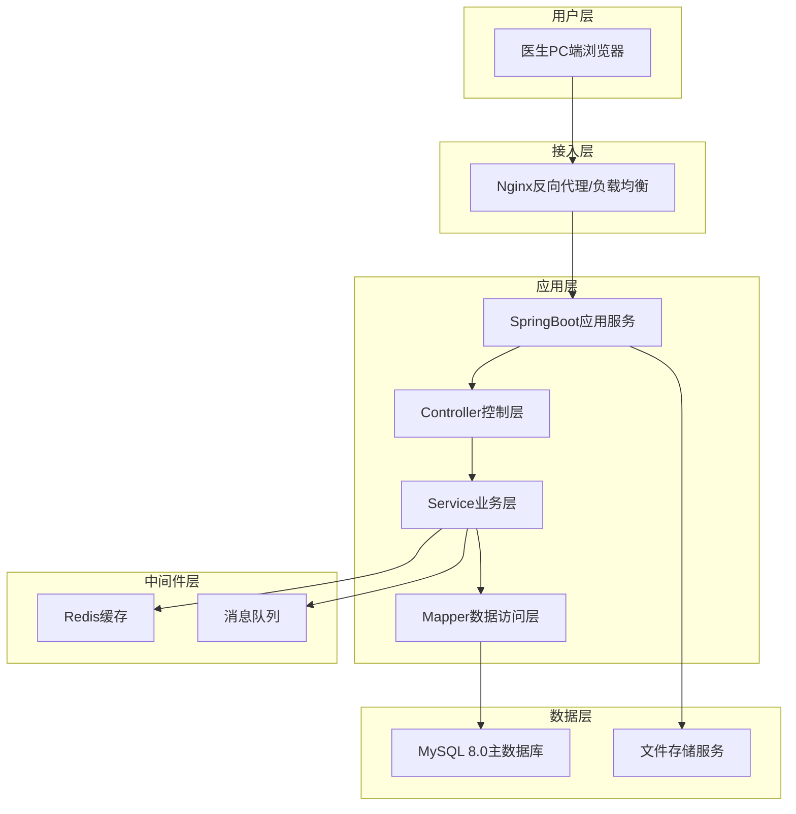
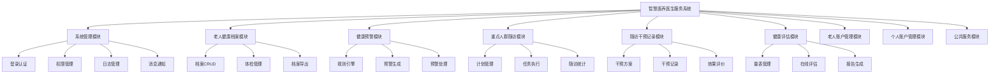
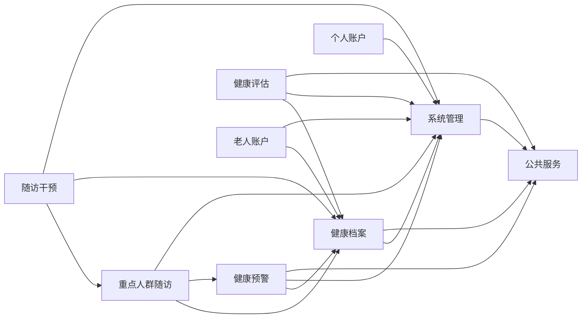
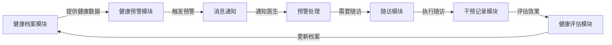
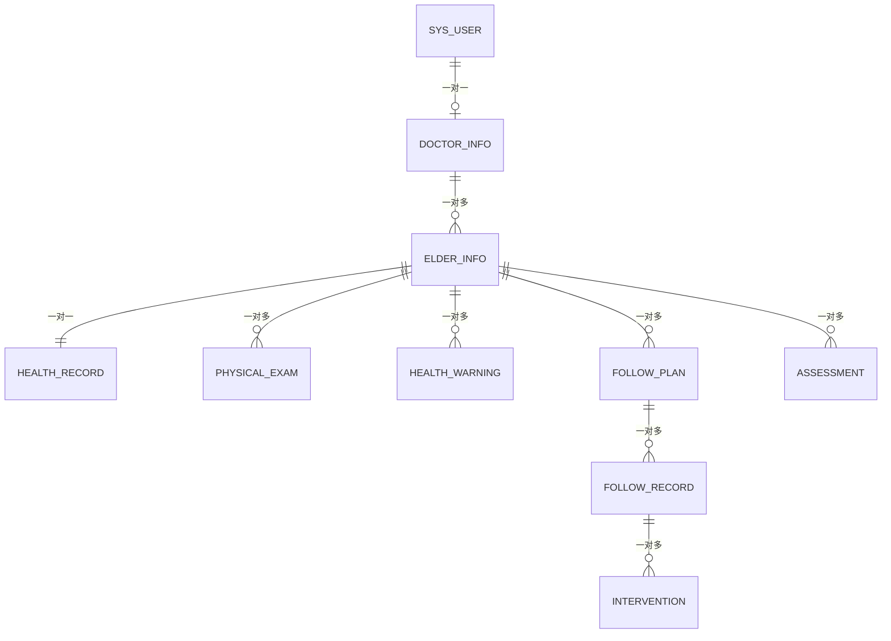
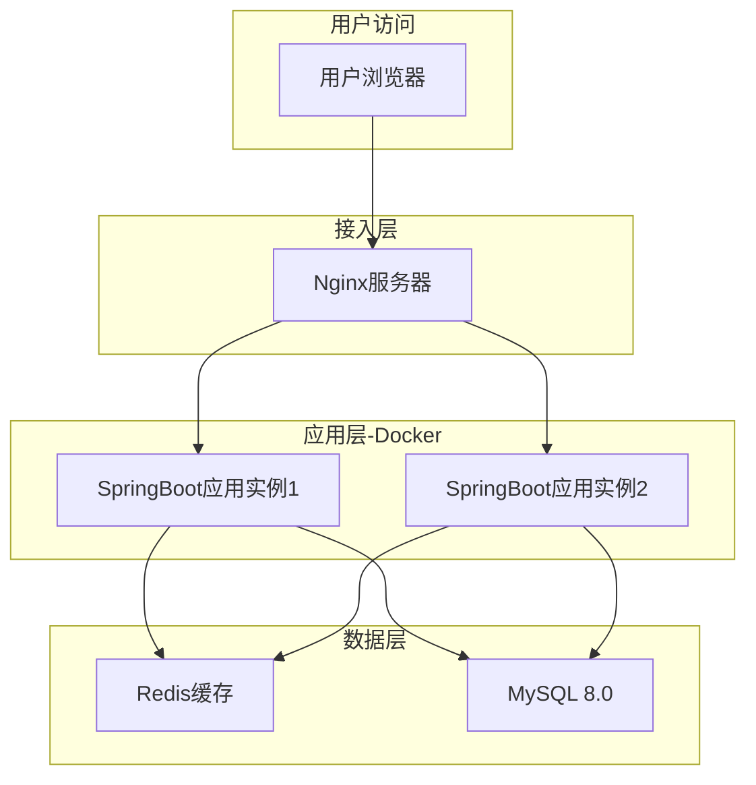

# 智慧医养大数据公共服务平台医生服务系统 概要设计文档

## 1. 引言

### 1.1 编写目的

本文档是《智慧医养大数据公共服务平台医生服务系统》的概要设计文档，旨在从整体上规划系统结构，明确系统架构、模块划分、模块间协作关系及数据库整体结构，为后续详细设计和编码实现提供技术指导。

### 1.2 项目背景

本系统是智慧医养大数据公共服务平台的医生端子系统，面向参与医养结合工作的医生用户，提供老年人健康档案管理、健康预警、重点人群随访、干预记录、健康评估等全流程信息化服务。

### 1.3 设计原则

| 原则 | 说明 |
|------|------|
| 高内聚低耦合 | 模块内部功能紧密关联，模块间依赖最小化 |
| 分层架构 | 表现层、业务层、数据层职责分离 |
| 可扩展性 | 采用面向接口编程，支持功能模块的灵活扩展 |
| 安全性 | 全链路安全防护，数据加密存储和传输 |
| 高可用 | 服务无状态化，支持水平扩展和容错 |
| 可维护性 | 统一的编码规范和日志规范，便于问题排查 |

---

## 2. 系统总体架构

### 2.1 系统架构图



### 2.2 架构分层说明

| 层次 | 职责 | 技术选型 |
|------|------|----------|
| 用户层 | 提供用户交互界面 | HTML/CSS/JavaScript前端框架 |
| 接入层 | 请求路由、负载均衡、静态资源服务、SSL终止 | Nginx |
| 控制层 | 接收HTTP请求、参数校验、响应封装 | SpringMVC |
| 业务层 | 核心业务逻辑处理、事务管理 | Spring/SpringBoot |
| 数据访问层 | 数据库CRUD操作、SQL映射 | MyBatis/MyBatis-Plus |
| 缓存层 | 热点数据缓存、会话管理、分布式锁 | Redis |
| 数据层 | 持久化数据存储 | MySQL 8.0 |

### 2.3 技术架构选型

```
┌─────────────────────────────────────────────────────────────┐
│                        前端技术栈                             │
│   HTML5 + CSS3 + JavaScript + 前端框架(Vue/LayUI)           │
├─────────────────────────────────────────────────────────────┤
│                        后端技术栈                             │
│   SpringBoot 2.x + SpringMVC + MyBatis-Plus                 │
├─────────────────────────────────────────────────────────────┤
│                        安全框架                               │
│   Spring Security / Shiro + JWT Token                        │
├─────────────────────────────────────────────────────────────┤
│                        中间件                                 │
│   Redis(缓存/会话) + Nginx(代理/静态) + 消息队列             │
├─────────────────────────────────────────────────────────────┤
│                        数据存储                               │
│   MySQL 8.0 + Redis + 文件服务器                             │
├─────────────────────────────────────────────────────────────┤
│                        部署环境                               │
│   Linux + Docker + Nginx                                     │
└─────────────────────────────────────────────────────────────┘
```

---

## 3. 系统模块划分

### 3.1 模块结构图



### 3.2 模块职责说明

| 模块 | 核心职责 | 对外提供的能力 |
|------|----------|----------------|
| 系统管理模块 | 用户认证、权限控制、日志审计、消息通知 | 统一安全认证、权限校验、日志记录服务 |
| 老人健康档案模块 | 老年人基本信息和健康数据的全生命周期管理 | 老人信息查询、档案数据提供 |
| 健康预警模块 | 基于规则引擎对健康异常进行实时预警 | 预警生成、预警推送、预警查询 |
| 重点人群随访模块 | 管理慢病重点人群的随访计划和执行 | 随访任务管理、随访记录查询 |
| 随访干预记录模块 | 记录和管理随访过程中的干预措施 | 干预记录查询、干预效果统计 |
| 健康评估模块 | 使用标准化量表进行多维度健康评估 | 评估执行、评估结果查询、报告生成 |
| 老人账户管理模块 | 管理老年人系统账户的创建和维护 | 老人账户CRUD |
| 个人账户管理模块 | 医生个人信息和账户安全管理 | 个人信息维护 |
| 公共服务模块 | 提供通用的基础服务能力 | 文件上传/下载、字典服务、导出服务 |

### 3.3 模块代码包结构

```
com.medical.doctor
├── common/                    # 公共模块
│   ├── config/               # 配置类
│   ├── constant/             # 常量定义
│   ├── enums/                # 枚举类
│   ├── exception/            # 异常处理
│   ├── result/               # 统一响应
│   └── utils/                # 工具类
├── security/                  # 安全模块
│   ├── config/               # 安全配置
│   ├── filter/               # 过滤器
│   ├── handler/              # 处理器
│   └── service/              # 认证服务
├── system/                    # 系统管理模块
│   ├── controller/
│   ├── service/
│   ├── mapper/
│   └── entity/
├── archive/                   # 健康档案模块
│   ├── controller/
│   ├── service/
│   ├── mapper/
│   └── entity/
├── warning/                   # 健康预警模块
│   ├── controller/
│   ├── service/
│   ├── mapper/
│   ├── entity/
│   └── engine/               # 规则引擎
├── followup/                  # 随访管理模块
│   ├── controller/
│   ├── service/
│   ├── mapper/
│   └── entity/
├── intervention/              # 干预记录模块
│   ├── controller/
│   ├── service/
│   ├── mapper/
│   └── entity/
├── assessment/                # 健康评估模块
│   ├── controller/
│   ├── service/
│   ├── mapper/
│   └── entity/
└── account/                   # 账户管理模块
    ├── controller/
    ├── service/
    ├── mapper/
    └── entity/
```

---

## 4. 模块间协作关系

### 4.1 模块依赖关系图



### 4.2 核心业务协作流程

#### 4.2.1 老人健康管理主协作流程



#### 4.2.2 模块间调用关系

| 调用方 | 被调用方 | 调用场景 | 调用方式 |
|--------|----------|----------|----------|
| 健康预警模块 | 健康档案模块 | 获取老人最新健康指标 | Service层内部调用 |
| 健康预警模块 | 系统管理模块 | 发送预警通知给医生 | 消息通知服务 |
| 随访模块 | 健康档案模块 | 查询老人基本信息和病史 | Service层内部调用 |
| 随访模块 | 健康预警模块 | 随访中发现异常触发预警 | Service层内部调用 |
| 干预模块 | 随访模块 | 获取随访记录关联信息 | Service层内部调用 |
| 健康评估模块 | 健康档案模块 | 获取老人历史评估数据 | Service层内部调用 |
| 老人账户模块 | 健康档案模块 | 创建账户时同步创建档案 | Service层事务调用 |

---

## 5. 数据库整体结构设计

### 5.1 数据库架构

```
┌──────────────────────────────────────────────────────────────┐
│                      MySQL 8.0 主库                           │
├──────────────────────────────────────────────────────────────┤
│                                                              │
│  ┌─────────────┐  ┌─────────────┐  ┌─────────────────────┐ │
│  │ 系统管理库   │  │ 业务数据库   │  │    配置数据         │ │
│  │             │  │             │  │                     │ │
│  │ sys_user    │  │ elder_info  │  │ warning_rule        │ │
│  │ sys_role    │  │ health_record│ │ assessment_scale    │ │
│  │ sys_menu    │  │ physical_exam│ │ sys_dict            │ │
│  │ sys_log     │  │ health_warning│ │                    │ │
│  │ sys_notify  │  │ follow_plan │  │                     │ │
│  │             │  │ follow_record│ │                     │ │
│  │             │  │ intervention│  │                     │ │
│  │             │  │ assessment  │  │                     │ │
│  └─────────────┘  └─────────────┘  └─────────────────────┘ │
│                                                              │
├──────────────────────────────────────────────────────────────┤
│                      Redis 缓存                              │
│  ├── Token缓存（用户会话）                                    │
│  ├── 字典缓存（系统配置）                                     │
│  ├── 热点数据缓存（高频查询）                                  │
│  └── 分布式锁（并发控制）                                     │
└──────────────────────────────────────────────────────────────┘
```

### 5.2 数据库实体关系总览



### 5.3 数据访问策略

| 策略 | 说明 |
|------|------|
| 读写分离 | 预留主从架构，写操作走主库，读操作走从库 |
| 缓存策略 | 热点数据（字典、用户信息）使用Redis缓存，设置合理的TTL |
| 分页查询 | 所有列表查询强制分页，避免全表扫描 |
| 慢SQL监控 | 开启慢查询日志，阈值设置为2秒 |
| 连接池 | 使用Druid连接池，配置合理的最大连接数 |

---

## 6. 接口设计原则

### 6.1 RESTful API 规范

| 规则 | 说明 | 示例 |
|------|------|------|
| 资源命名 | 使用名词复数 | `/api/elders`、`/api/follow-plans` |
| HTTP方法 | GET查询、POST创建、PUT修改、DELETE删除 | `GET /api/elders/{id}` |
| 版本控制 | URL路径版本号 | `/api/v1/elders` |
| 统一响应 | 统一JSON响应格式 | `{code, msg, data}` |
| 分页参数 | 统一分页参数 | `?pageNum=1&pageSize=10` |

### 6.2 统一响应格式

```json
{
  "code": 200,
  "msg": "操作成功",
  "data": {},
  "timestamp": 1686000000000
}
```

### 6.3 统一异常处理

| HTTP状态码 | 业务码 | 说明 |
|-----------|--------|------|
| 200 | 200 | 请求成功 |
| 200 | 400 | 参数校验失败 |
| 200 | 401 | 未认证/Token过期 |
| 200 | 403 | 无权限访问 |
| 200 | 500 | 服务器内部错误 |
| 200 | 1001-1999 | 业务异常编码 |

---

## 7. 安全架构设计

### 7.1 认证流程


### 7.2 安全防护策略

| 防护层面 | 措施 |
|----------|------|
| 传输安全 | HTTPS + Nginx SSL终止 |
| 认证机制 | JWT Token + Redis会话管理 |
| 授权控制 | RBAC + 注解式权限校验 |
| 数据安全 | 敏感字段AES加密、密码BCrypt加密 |
| 接口安全 | 接口限流、防重复提交、参数校验 |
| SQL安全 | MyBatis参数化查询、防注入 |
| XSS防护 | 输入过滤 + 输出转义 |
| CSRF防护 | Token验证机制 |

---

## 8. 部署架构设计

### 8.1 部署拓扑图



### 8.2 环境规划

| 环境 | 用途 | 配置 |
|------|------|------|
| 开发环境(DEV) | 开发调试 | Windows本地，单节点 |
| 测试环境(TEST) | 功能测试和集成测试 | Linux，Docker单节点 |
| 预生产环境(UAT) | 用户验收测试 | Linux，Docker，模拟生产配置 |
| 生产环境(PROD) | 正式运行 | Linux，Docker，双节点+Nginx负载均衡 |

---

## 9. 关键技术方案

### 9.1 预警规则引擎

采用自定义规则引擎，基于配置化的规则表实现健康数据的实时匹配和预警生成：

```
数据采集 → 规则加载(Redis缓存) → 指标匹配 → 预警等级判定 → 预警记录入库 → 消息通知推送
```

### 9.2 分布式会话管理

使用Redis存储JWT Token实现分布式会话：
- Token有效期：2小时
- 刷新机制：活跃用户自动续期
- 踢出机制：管理员可强制用户下线

### 9.3 文件导出方案

- Excel导出：Apache POI / EasyExcel
- PDF导出：iText / Flying Saucer
- 大数据量导出：异步导出 + 文件下载通知

---

**文档版本**：V1.0  
**编写日期**：2026年6月  
**编写人**：系统架构师  
**审核人**：项目经理  
**状态**：初稿
