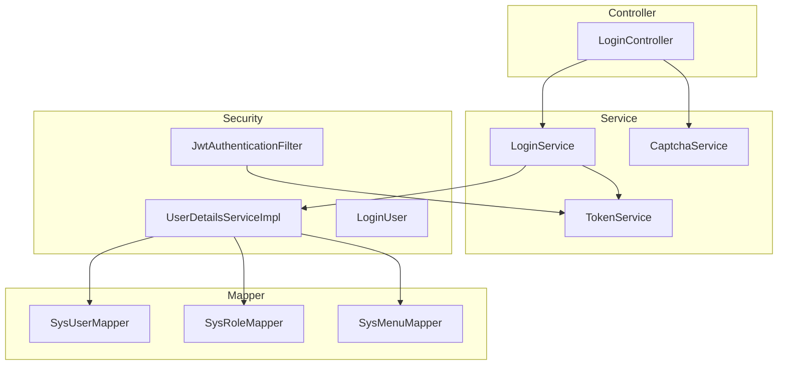
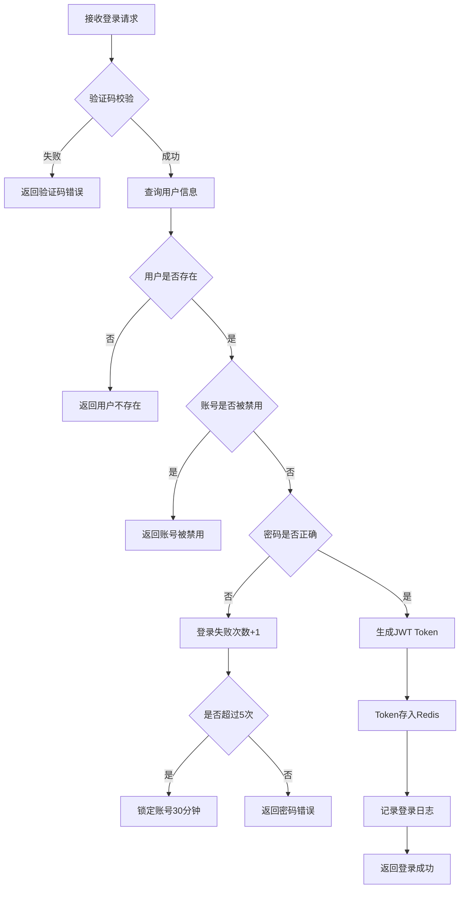
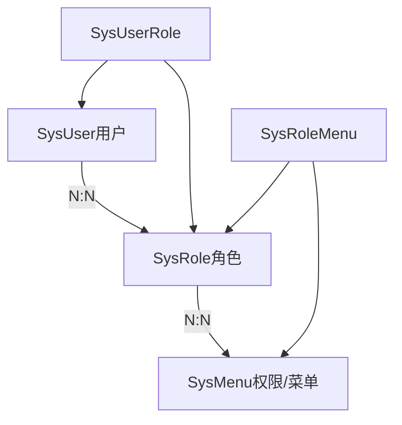
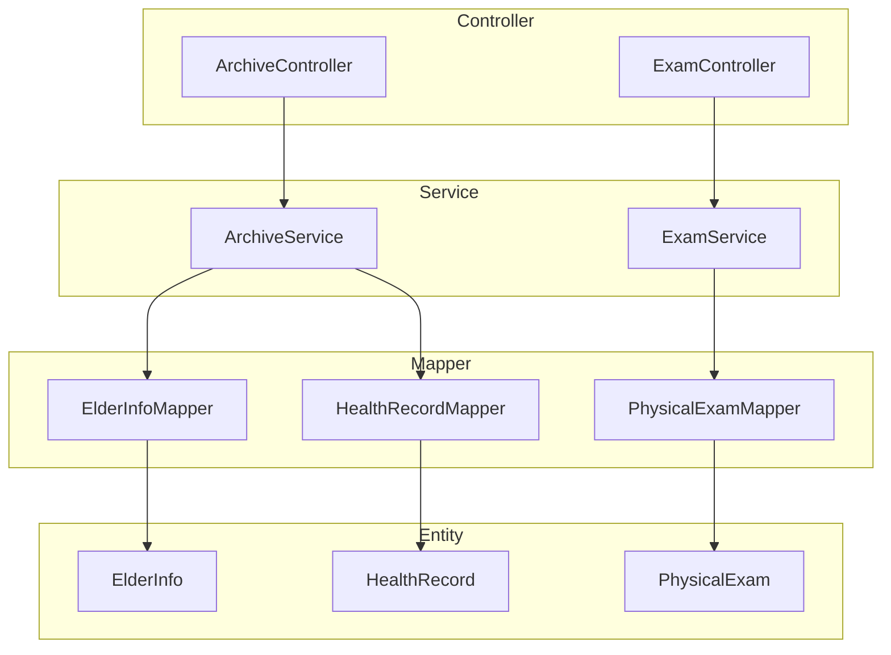
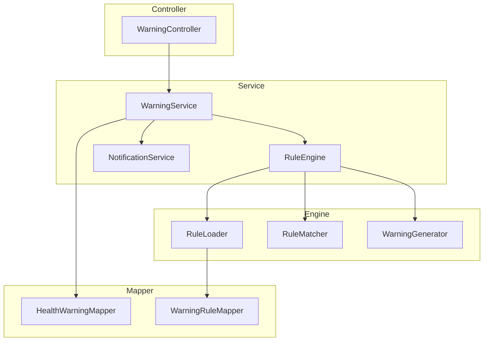
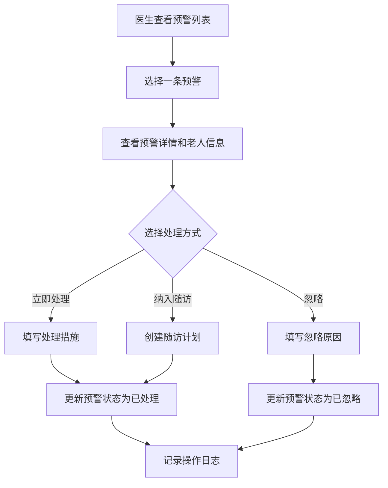
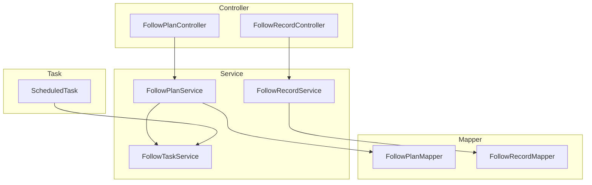
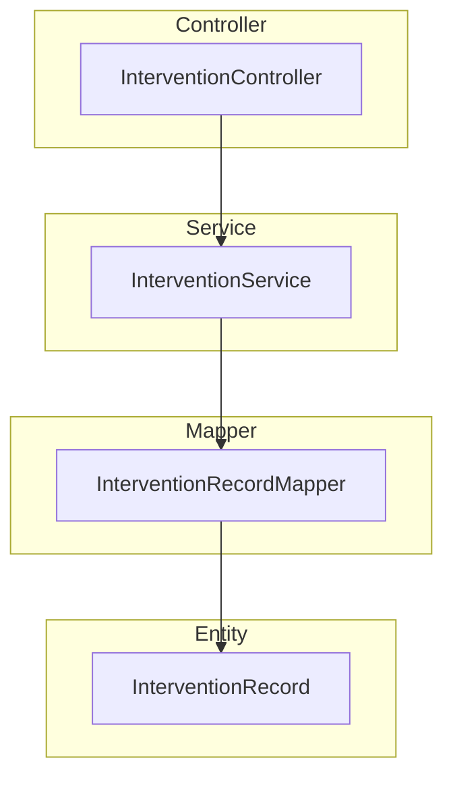
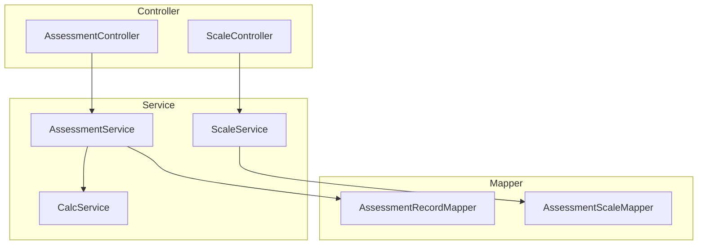

# 智慧医养大数据公共服务平台医生服务系统 详细设计文档

## 1. 引言

### 1.1 编写目的

本文档是《智慧医养大数据公共服务平台医生服务系统》的详细设计文档，在概要设计的基础上，进一步明确每个模块的内部逻辑、类与类之间的关系、接口设计、数据库表结构、核心算法流程等，为编码实现提供直接指导。

### 1.2 设计约定

- 所有实体类使用Lombok简化代码
- Controller层仅负责参数校验和响应封装，不包含业务逻辑
- Service层进行业务逻辑处理和事务管理
- Mapper层使用MyBatis-Plus提供的BaseMapper + 自定义XML
- 统一使用`@RestController`和`@RequestMapping`注解

---

## 2. 公共基础设计

### 2.1 统一响应封装

```java
/**
 * 统一API响应结果
 */
public class R<T> {
    private Integer code;       // 状态码
    private String msg;         // 提示信息
    private T data;             // 数据体
    private Long timestamp;     // 时间戳

    public static <T> R<T> ok(T data) {...}
    public static <T> R<T> fail(String msg) {...}
    public static <T> R<T> fail(Integer code, String msg) {...}
}
```

### 2.2 分页请求/响应

```java
/**
 * 分页请求参数
 */
public class PageQuery {
    private Integer pageNum = 1;     // 当前页码
    private Integer pageSize = 10;   // 每页条数
    private String orderBy;          // 排序字段
    private String orderDir;         // 排序方向 asc/desc
}

/**
 * 分页响应结果
 */
public class PageResult<T> {
    private List<T> records;         // 数据列表
    private Long total;              // 总记录数
    private Integer pageNum;         // 当前页
    private Integer pageSize;        // 每页条数
    private Integer pages;           // 总页数
}
```

### 2.3 全局异常处理

```java
/**
 * 业务异常
 */
public class BusinessException extends RuntimeException {
    private Integer code;
    private String message;
}

/**
 * 全局异常处理器
 */
@RestControllerAdvice
public class GlobalExceptionHandler {
    // 处理业务异常
    @ExceptionHandler(BusinessException.class)
    public R<?> handleBusinessException(BusinessException e) {...}
    
    // 处理参数校验异常
    @ExceptionHandler(MethodArgumentNotValidException.class)
    public R<?> handleValidException(MethodArgumentNotValidException e) {...}
    
    // 处理未知异常
    @ExceptionHandler(Exception.class)
    public R<?> handleException(Exception e) {...}
}
```

### 2.4 基础实体类

```java
/**
 * 所有实体的基类
 */
@Data
public class BaseEntity implements Serializable {
    @TableId(type = IdType.AUTO)
    private Long id;
    
    @TableField(fill = FieldFill.INSERT)
    private LocalDateTime createTime;
    
    @TableField(fill = FieldFill.INSERT_UPDATE)
    private LocalDateTime updateTime;
    
    @TableLogic
    private Integer deleted;
}
```

---

## 3. 系统管理模块详细设计

### 3.1 登录认证子模块

#### 3.1.1 类设计



#### 3.1.2 接口设计

| 接口 | 方法 | URL | 说明 |
|------|------|-----|------|
| 登录 | POST | /api/auth/login | 用户登录获取Token |
| 登出 | POST | /api/auth/logout | 注销登录 |
| 获取验证码 | GET | /api/auth/captcha | 获取图形验证码 |
| 刷新Token | POST | /api/auth/refresh | 刷新访问令牌 |
| 获取用户信息 | GET | /api/auth/info | 获取当前登录用户信息 |

#### 3.1.3 登录接口详细设计

**请求参数**：
```java
public class LoginDTO {
    @NotBlank(message = "用户名不能为空")
    private String username;
    
    @NotBlank(message = "密码不能为空")
    private String password;
    
    @NotBlank(message = "验证码不能为空")
    private String captcha;
    
    private String captchaKey;    // 验证码标识
}
```

**响应数据**：
```java
public class LoginVO {
    private String token;          // JWT Token
    private Long expireTime;       // 过期时间
    private String username;       // 用户名
    private String realName;       // 真实姓名
    private List<String> roles;    // 角色列表
    private List<String> permissions; // 权限列表
}
```

**业务流程**：



#### 3.1.4 Token管理服务

```java
public interface TokenService {
    /**
     * 生成Token
     * @param loginUser 登录用户信息
     * @return JWT Token字符串
     */
    String createToken(LoginUser loginUser);
    
    /**
     * 验证Token有效性
     * @param token JWT Token
     * @return 登录用户信息，无效返回null
     */
    LoginUser verifyToken(String token);
    
    /**
     * 刷新Token有效期
     * @param loginUser 登录用户
     */
    void refreshToken(LoginUser loginUser);
    
    /**
     * 删除Token（登出）
     * @param token JWT Token
     */
    void removeToken(String token);
}
```

**Redis存储结构**：
```
Key:   login_token:{uuid}
Value: LoginUser JSON序列化
TTL:   7200秒（2小时）
```

---

### 3.2 权限管理子模块

#### 3.2.1 RBAC模型类图



#### 3.2.2 权限校验注解

```java
/**
 * 自定义权限校验注解
 */
@Target(ElementType.METHOD)
@Retention(RetentionPolicy.RUNTIME)
public @interface RequiresPermission {
    String value();  // 权限标识，如 "elder:archive:view"
}
```

**权限标识命名规范**：`模块:子模块:操作`

| 权限标识 | 说明 |
|----------|------|
| system:user:list | 查看用户列表 |
| elder:archive:view | 查看老人档案 |
| elder:archive:edit | 编辑老人档案 |
| warning:handle | 处理健康预警 |
| followup:plan:create | 创建随访计划 |
| assessment:execute | 执行健康评估 |

---

## 4. 老人健康档案模块详细设计

### 4.1 类设计



### 4.2 接口设计

| 接口 | 方法 | URL | 说明 |
|------|------|-----|------|
| 老人列表 | GET | /api/elders | 分页查询老人列表 |
| 老人详情 | GET | /api/elders/{id} | 获取老人详细信息 |
| 新建老人 | POST | /api/elders | 新建老人信息 |
| 修改老人 | PUT | /api/elders/{id} | 修改老人信息 |
| 删除老人 | DELETE | /api/elders/{id} | 删除老人信息（逻辑删除）|
| 档案详情 | GET | /api/elders/{id}/record | 获取健康档案 |
| 创建档案 | POST | /api/elders/{id}/record | 创建健康档案 |
| 更新档案 | PUT | /api/records/{id} | 更新健康档案 |
| 体检列表 | GET | /api/elders/{id}/exams | 查询体检记录 |
| 新增体检 | POST | /api/elders/{id}/exams | 新增体检记录 |
| 体检详情 | GET | /api/exams/{id} | 体检详情 |
| 导出档案 | GET | /api/elders/{id}/export | 导出健康档案PDF |

### 4.3 核心Service方法设计

```java
public interface ArchiveService {
    
    /**
     * 分页查询老人列表
     * @param query 查询条件（姓名、身份证、社区、医生ID等）
     * @return 分页结果
     */
    PageResult<ElderListVO> pageElders(ElderQueryDTO query);
    
    /**
     * 获取老人详细信息（含健康档案）
     * @param elderId 老人ID
     * @return 老人完整信息
     */
    ElderDetailVO getElderDetail(Long elderId);
    
    /**
     * 创建老人信息及健康档案
     * @param dto 老人信息
     * @return 老人ID
     * 事务：老人信息 + 健康档案同步创建
     */
    @Transactional
    Long createElderWithRecord(ElderCreateDTO dto);
    
    /**
     * 更新老人基本信息
     * @param dto 更新数据
     */
    void updateElderInfo(ElderUpdateDTO dto);
    
    /**
     * 更新健康档案
     * @param dto 档案更新数据
     */
    void updateHealthRecord(HealthRecordUpdateDTO dto);
    
    /**
     * 导出老人健康档案为PDF
     * @param elderId 老人ID
     * @return PDF文件路径
     */
    String exportArchivePdf(Long elderId);
}
```

### 4.4 DTO/VO 设计

```java
// 老人列表查询条件
public class ElderQueryDTO extends PageQuery {
    private String name;           // 姓名（模糊搜索）
    private String idCard;         // 身份证号
    private Long doctorId;         // 责任医生ID
    private String community;      // 所属社区
    private Integer accountStatus; // 账户状态
}

// 老人列表展示
public class ElderListVO {
    private Long id;
    private String name;
    private Integer gender;
    private Integer age;
    private String phone;
    private String community;
    private String doctorName;     // 责任医生姓名
    private Integer accountStatus;
    private LocalDateTime createTime;
}

// 老人完整详情
public class ElderDetailVO {
    private Long id;
    private String name;
    private Integer gender;
    private LocalDate birthDate;
    private String idCard;
    private String phone;
    private String emergencyContact;
    private String emergencyPhone;
    private String address;
    private String community;
    private HealthRecordVO healthRecord;  // 健康档案
    private List<PhysicalExamVO> recentExams; // 最近体检
    private DoctorSimpleVO doctor;        // 责任医生
}
```

---

## 5. 健康预警模块详细设计

### 5.1 类设计



### 5.2 接口设计

| 接口 | 方法 | URL | 说明 |
|------|------|-----|------|
| 预警列表 | GET | /api/warnings | 分页查询预警列表 |
| 预警详情 | GET | /api/warnings/{id} | 获取预警详情 |
| 处理预警 | PUT | /api/warnings/{id}/handle | 处理预警 |
| 忽略预警 | PUT | /api/warnings/{id}/ignore | 忽略预警 |
| 预警统计 | GET | /api/warnings/statistics | 预警统计数据 |
| 规则列表 | GET | /api/warning-rules | 预警规则列表 |
| 新增规则 | POST | /api/warning-rules | 新增预警规则 |
| 修改规则 | PUT | /api/warning-rules/{id} | 修改预警规则 |
| 启停规则 | PUT | /api/warning-rules/{id}/status | 启用/禁用规则 |

### 5.3 预警规则引擎算法

```java
/**
 * 预警规则引擎 - 核心匹配逻辑
 */
@Component
public class RuleEngine {
    
    @Autowired
    private RedisTemplate<String, Object> redisTemplate;
    
    @Autowired
    private WarningRuleMapper ruleMapper;
    
    /**
     * 执行健康数据预警检测
     * @param elderHealthData 老人最新健康数据
     * @return 命中的预警列表
     */
    public List<WarningResult> evaluate(ElderHealthData elderHealthData) {
        // 1. 从Redis加载预警规则（缓存优先）
        List<WarningRule> rules = loadActiveRules();
        
        // 2. 遍历规则逐一匹配
        List<WarningResult> results = new ArrayList<>();
        for (WarningRule rule : rules) {
            if (matchRule(rule, elderHealthData)) {
                WarningResult result = generateWarning(rule, elderHealthData);
                results.add(result);
            }
        }
        return results;
    }
    
    /**
     * 规则匹配逻辑
     */
    private boolean matchRule(WarningRule rule, ElderHealthData data) {
        // 获取对应指标的实际值
        BigDecimal actualValue = getIndicatorValue(rule.getIndicatorCode(), data);
        if (actualValue == null) return false;
        
        // 根据运算符进行比较
        switch (rule.getOperator()) {
            case ">":  return actualValue.compareTo(rule.getThresholdMax()) > 0;
            case "<":  return actualValue.compareTo(rule.getThresholdMin()) < 0;
            case ">=": return actualValue.compareTo(rule.getThresholdMax()) >= 0;
            case "<=": return actualValue.compareTo(rule.getThresholdMin()) <= 0;
            case "between": 
                return actualValue.compareTo(rule.getThresholdMin()) < 0 
                    || actualValue.compareTo(rule.getThresholdMax()) > 0;
            default: return false;
        }
    }
}
```

**预警检测触发时机**：

| 触发场景 | 说明 |
|----------|------|
| 体检数据录入 | 新增体检记录后自动触发预警检测 |
| 随访数据录入 | 随访记录中的健康指标触发检测 |
| 定时任务 | 每日定时检查用药提醒和复诊提醒 |

### 5.4 预警处理流程



---

## 6. 重点人群随访模块详细设计

### 6.1 类设计



### 6.2 接口设计

| 接口 | 方法 | URL | 说明 |
|------|------|-----|------|
| 随访计划列表 | GET | /api/follow-plans | 查询随访计划列表 |
| 创建随访计划 | POST | /api/follow-plans | 创建新的随访计划 |
| 计划详情 | GET | /api/follow-plans/{id} | 计划详情 |
| 修改计划 | PUT | /api/follow-plans/{id} | 修改随访计划 |
| 暂停/恢复计划 | PUT | /api/follow-plans/{id}/status | 暂停或恢复计划 |
| 待执行任务 | GET | /api/follow-tasks | 查询待执行随访任务 |
| 随访记录列表 | GET | /api/follow-records | 随访记录列表 |
| 填写随访记录 | POST | /api/follow-records | 新增随访记录 |
| 随访记录详情 | GET | /api/follow-records/{id} | 随访记录详情 |
| 随访统计 | GET | /api/follow-plans/statistics | 随访完成率统计 |

### 6.3 随访计划创建流程

```java
public interface FollowPlanService {
    
    /**
     * 创建随访计划
     * 逻辑：
     * 1. 校验老人是否存在
     * 2. 校验是否已有同病种进行中的计划
     * 3. 根据频次计算下次随访日期
     * 4. 保存计划并生成首次随访任务
     */
    @Transactional
    Long createPlan(FollowPlanCreateDTO dto);
    
    /**
     * 查询医生待执行的随访任务
     * 包括：今日待随访 + 逾期未随访
     */
    PageResult<FollowTaskVO> getMyTasks(Long doctorId, PageQuery query);
    
    /**
     * 完成随访（填写记录后更新计划状态）
     * 逻辑：
     * 1. 保存随访记录
     * 2. 更新计划完成次数
     * 3. 计算下次随访日期
     * 4. 触发健康数据预警检测
     */
    @Transactional
    void completeFollow(FollowRecordCreateDTO dto);
}
```

### 6.4 下次随访日期计算算法

```java
/**
 * 根据频次类型计算下次随访日期
 */
public LocalDate calculateNextFollowDate(LocalDate currentDate, Integer frequencyType, Integer frequencyCount) {
    switch (frequencyType) {
        case 1: // 每周
            return currentDate.plusWeeks(1).dividedBy(frequencyCount);
        case 2: // 每月
            return currentDate.plusMonths(1);
        case 3: // 每季度
            return currentDate.plusMonths(3);
        case 4: // 每半年
            return currentDate.plusMonths(6);
        case 5: // 每年
            return currentDate.plusYears(1);
        default:
            return currentDate.plusMonths(3); // 默认每季度
    }
}
```

### 6.5 逾期预警定时任务

```java
/**
 * 定时任务：每日检查逾期随访
 * 执行时间：每日凌晨 8:00
 */
@Scheduled(cron = "0 0 8 * * ?")
public void checkOverdueFollowUp() {
    // 1. 查询所有 next_follow_date < 当前日期 且 status=进行中 的计划
    // 2. 对逾期计划生成预警通知
    // 3. 标记对应随访记录为逾期
    // 4. 推送消息通知给责任医生
}
```

---

## 7. 随访干预记录模块详细设计

### 7.1 类设计



### 7.2 接口设计

| 接口 | 方法 | URL | 说明 |
|------|------|-----|------|
| 干预记录列表 | GET | /api/interventions | 分页查询干预记录 |
| 新增干预记录 | POST | /api/interventions | 新增干预记录 |
| 干预记录详情 | GET | /api/interventions/{id} | 查看干预详情 |
| 修改干预记录 | PUT | /api/interventions/{id} | 修改干预记录 |
| 效果评价 | PUT | /api/interventions/{id}/evaluate | 干预效果评价 |
| 老人干预历史 | GET | /api/elders/{id}/interventions | 老人的干预历史 |

### 7.3 干预记录创建

```java
/**
 * 新增干预记录DTO
 */
public class InterventionCreateDTO {
    @NotNull
    private Long followRecordId;       // 关联随访记录ID
    
    @NotNull
    private Long elderId;              // 老人ID
    
    @NotNull
    private Integer interventionType;  // 干预类型
    
    @NotBlank
    private String interventionContent; // 干预内容详情
    
    private MedicationAdjust medicationAdjust; // 药物调整（嵌套对象）
    private String dietGuidance;       // 饮食指导
    private String exerciseGuidance;   // 运动指导
    private String healthEducation;    // 健康宣教
    private ReferralInfo referralInfo; // 转诊信息（嵌套对象）
    private String targetGoal;         // 干预目标
}

/**
 * 药物调整信息
 */
public class MedicationAdjust {
    private List<MedicationItem> addedMeds;    // 新增药物
    private List<MedicationItem> removedMeds;  // 停用药物
    private List<MedicationItem> adjustedMeds; // 调整药物
}

/**
 * 转诊信息
 */
public class ReferralInfo {
    private String hospital;      // 转诊医院
    private String department;    // 转诊科室
    private String reason;        // 转诊原因
}
```

---

## 8. 健康评估模块详细设计

### 8.1 类设计



### 8.2 接口设计

| 接口 | 方法 | URL | 说明 |
|------|------|-----|------|
| 量表列表 | GET | /api/scales | 获取评估量表列表 |
| 量表详情 | GET | /api/scales/{code} | 获取量表题目详情 |
| 提交评估 | POST | /api/assessments | 提交评估答案并计算得分 |
| 评估记录列表 | GET | /api/assessments | 评估记录列表 |
| 评估详情 | GET | /api/assessments/{id} | 评估详情 |
| 老人评估历史 | GET | /api/elders/{id}/assessments | 老人评估历史 |
| 评估趋势 | GET | /api/elders/{id}/assessment-trend | 评估得分趋势 |
| 综合评估报告 | GET | /api/elders/{id}/assessment-report | 生成综合报告 |

### 8.3 评估计分算法

```java
/**
 * 评估计分服务
 */
@Service
public class CalcService {
    
    /**
     * 计算评估总分
     * @param scaleCode 量表编码
     * @param answers 用户提交的答案 Map<题目编号, 选项值>
     * @return 评估结果
     */
    public AssessmentCalcResult calculate(String scaleCode, Map<String, Integer> answers) {
        // 1. 加载量表评分规则
        AssessmentScale scale = scaleService.getByCode(scaleCode);
        List<ScaleItem> items = JSON.parseArray(scale.getItems(), ScaleItem.class);
        List<LevelRule> levelRules = JSON.parseArray(scale.getLevelRules(), LevelRule.class);
        
        // 2. 计算各题得分
        Map<String, BigDecimal> detailScores = new HashMap<>();
        BigDecimal totalScore = BigDecimal.ZERO;
        
        for (ScaleItem item : items) {
            Integer answer = answers.get(item.getItemCode());
            BigDecimal itemScore = item.getScoreMap().get(answer);
            detailScores.put(item.getItemCode(), itemScore);
            totalScore = totalScore.add(itemScore);
        }
        
        // 3. 根据总分判定等级
        Integer resultLevel = determineLevel(totalScore, levelRules);
        String resultDesc = getLevelDescription(resultLevel, levelRules);
        
        // 4. 封装结果
        AssessmentCalcResult result = new AssessmentCalcResult();
        result.setTotalScore(totalScore);
        result.setDetailScores(detailScores);
        result.setResultLevel(resultLevel);
        result.setResultDesc(resultDesc);
        return result;
    }
    
    /**
     * 根据总分判定等级
     */
    private Integer determineLevel(BigDecimal score, List<LevelRule> rules) {
        for (LevelRule rule : rules) {
            if (score.compareTo(rule.getMinScore()) >= 0 
                && score.compareTo(rule.getMaxScore()) <= 0) {
                return rule.getLevel();
            }
        }
        return 1; // 默认正常
    }
}
```

### 8.4 量表数据结构（JSON格式）

```json
{
  "items": [
    {
      "itemCode": "Q1",
      "itemName": "进食",
      "description": "评估老人独立进食能力",
      "options": [
        {"value": 0, "label": "完全依赖", "score": 0},
        {"value": 1, "label": "需要部分帮助", "score": 5},
        {"value": 2, "label": "完全独立", "score": 10}
      ]
    }
  ],
  "levelRules": [
    {"level": 1, "label": "正常", "minScore": 80, "maxScore": 100},
    {"level": 2, "label": "轻度依赖", "minScore": 60, "maxScore": 79},
    {"level": 3, "label": "中度依赖", "minScore": 40, "maxScore": 59},
    {"level": 4, "label": "重度依赖", "minScore": 0, "maxScore": 39}
  ]
}
```

---

## 9. 老人账户管理模块详细设计

### 9.1 接口设计

| 接口 | 方法 | URL | 说明 |
|------|------|-----|------|
| 账户列表 | GET | /api/elder-accounts | 老人账户列表 |
| 创建账户 | POST | /api/elder-accounts | 创建老人账户 |
| 修改账户 | PUT | /api/elder-accounts/{id} | 修改账户信息 |
| 启停账户 | PUT | /api/elder-accounts/{id}/status | 启用/停用账户 |
| 重置密码 | PUT | /api/elder-accounts/{id}/reset-password | 重置密码 |
| 绑定医生 | PUT | /api/elder-accounts/{id}/bindDoctor | 绑定/变更责任医生 |
| 批量导入 | POST | /api/elder-accounts/import | Excel批量导入 |
| 导入模板 | GET | /api/elder-accounts/template | 下载导入模板 |

### 9.2 批量导入算法

```java
/**
 * 批量导入老人账户
 * 处理逻辑：
 * 1. 解析Excel文件
 * 2. 数据格式校验（姓名、身份证、手机号格式）
 * 3. 唯一性校验（身份证号不重复）
 * 4. 批量插入数据库（每500条为一批）
 * 5. 返回导入结果（成功/失败条数和失败原因）
 */
@Transactional
public ImportResult batchImport(MultipartFile file) {
    // 使用EasyExcel解析
    List<ElderImportDTO> dataList = EasyExcel.read(file.getInputStream())
        .head(ElderImportDTO.class).sheet().doReadSync();
    
    int successCount = 0;
    List<ImportError> errors = new ArrayList<>();
    
    // 分批处理
    List<List<ElderImportDTO>> batches = Lists.partition(dataList, 500);
    for (List<ElderImportDTO> batch : batches) {
        for (ElderImportDTO dto : batch) {
            // 校验 + 插入
            String error = validate(dto);
            if (error != null) {
                errors.add(new ImportError(dto.getRowNum(), error));
            } else {
                elderInfoMapper.insert(convertToEntity(dto));
                successCount++;
            }
        }
    }
    
    return new ImportResult(successCount, errors.size(), errors);
}
```

---

## 10. 个人账户管理模块详细设计

### 10.1 接口设计

| 接口 | 方法 | URL | 说明 |
|------|------|-----|------|
| 获取个人信息 | GET | /api/profile | 获取当前医生个人信息 |
| 修改个人信息 | PUT | /api/profile | 修改个人信息 |
| 修改密码 | PUT | /api/profile/password | 修改登录密码 |
| 上传头像 | POST | /api/profile/avatar | 上传头像 |
| 我的消息 | GET | /api/profile/notifications | 获取我的消息通知 |
| 标记已读 | PUT | /api/profile/notifications/{id}/read | 标记消息已读 |
| 全部已读 | PUT | /api/profile/notifications/read-all | 全部标记已读 |
| 工作统计 | GET | /api/profile/work-stats | 获取工作量统计 |

### 10.2 修改密码逻辑

```java
/**
 * 修改密码
 * 安全校验：
 * 1. 验证原密码正确性
 * 2. 新密码不能与原密码相同
 * 3. 新密码强度校验（至少8位，含大小写字母和数字）
 * 4. 修改成功后清除Token，要求重新登录
 */
public void changePassword(PasswordChangeDTO dto) {
    Long userId = SecurityUtils.getCurrentUserId();
    SysUser user = userMapper.selectById(userId);
    
    // 校验原密码
    if (!passwordEncoder.matches(dto.getOldPassword(), user.getPassword())) {
        throw new BusinessException("原密码不正确");
    }
    
    // 校验新密码强度
    if (!isStrongPassword(dto.getNewPassword())) {
        throw new BusinessException("密码强度不足，需至少8位且包含大小写字母和数字");
    }
    
    // 更新密码
    user.setPassword(passwordEncoder.encode(dto.getNewPassword()));
    userMapper.updateById(user);
    
    // 清除Token，强制重新登录
    tokenService.removeToken(SecurityUtils.getCurrentToken());
}
```

---

## 11. 定时任务设计

| 任务名称 | Cron表达式 | 说明 |
|----------|-----------|------|
| 逾期随访检测 | `0 0 8 * * ?` | 每日8:00检测逾期未随访的计划 |
| 用药提醒 | `0 0 7,12,19 * * ?` | 每日7:00/12:00/19:00检测用药提醒 |
| 复诊提醒 | `0 0 9 * * ?` | 每日9:00检测近3天需复诊的老人 |
| 评估到期提醒 | `0 0 9 * * MON` | 每周一检测评估到期的老人 |
| 日志清理 | `0 0 2 1 * ?` | 每月1日凌晨2:00清理3个月前的日志 |
| 统计报表生成 | `0 0 1 1 * ?` | 每月1日凌晨1:00生成上月统计报表 |

---

## 12. 缓存设计

### 12.1 Redis Key 命名规范

```
项目前缀:业务模块:数据类型:唯一标识
```

### 12.2 缓存策略

| Key模式 | 数据内容 | 过期时间 | 更新策略 |
|---------|----------|----------|----------|
| `medical:token:{uuid}` | 登录Token信息 | 2小时 | 活跃续期 |
| `medical:captcha:{key}` | 验证码 | 5分钟 | 一次性使用后删除 |
| `medical:user:{userId}` | 用户信息缓存 | 30分钟 | 修改时主动删除 |
| `medical:permission:{userId}` | 用户权限列表 | 30分钟 | 权限变更时删除 |
| `medical:dict:{dictType}` | 数据字典 | 24小时 | 字典变更时删除 |
| `medical:warning:rules` | 预警规则列表 | 1小时 | 规则变更时删除 |
| `medical:login:error:{username}` | 登录错误次数 | 30分钟 | 登录成功后删除 |
| `medical:elder:detail:{elderId}` | 老人详情缓存 | 10分钟 | 数据修改后删除 |

---

## 13. 日志设计

### 13.1 操作日志切面

```java
/**
 * 操作日志注解
 */
@Target(ElementType.METHOD)
@Retention(RetentionPolicy.RUNTIME)
public @interface OperLog {
    String title() default "";       // 模块标题
    String action() default "";      // 操作描述
}

/**
 * 日志切面
 */
@Aspect
@Component
public class OperLogAspect {
    
    @Around("@annotation(operLog)")
    public Object around(ProceedingJoinPoint point, OperLog operLog) {
        long startTime = System.currentTimeMillis();
        Object result = null;
        Exception exception = null;
        
        try {
            result = point.proceed();
        } catch (Exception e) {
            exception = e;
            throw e;
        } finally {
            // 异步记录日志
            long executeTime = System.currentTimeMillis() - startTime;
            asyncSaveLog(operLog, point, result, exception, executeTime);
        }
        return result;
    }
}
```

### 13.2 使用示例

```java
@OperLog(title = "健康档案", action = "新建老人健康档案")
@PostMapping("/elders")
public R<Long> createElder(@Valid @RequestBody ElderCreateDTO dto) {
    return R.ok(archiveService.createElderWithRecord(dto));
}
```

---

## 14. 项目目录结构（完整）

```
medical-doctor-service/
├── pom.xml
├── src/
│   ├── main/
│   │   ├── java/com/medical/doctor/
│   │   │   ├── MedicalDoctorApplication.java        # 启动类
│   │   │   ├── common/
│   │   │   │   ├── annotation/                      # 自定义注解
│   │   │   │   │   ├── OperLog.java
│   │   │   │   │   └── RequiresPermission.java
│   │   │   │   ├── aspect/                          # AOP切面
│   │   │   │   │   ├── OperLogAspect.java
│   │   │   │   │   └── PermissionAspect.java
│   │   │   │   ├── config/                          # 全局配置
│   │   │   │   │   ├── CorsConfig.java
│   │   │   │   │   ├── MybatisPlusConfig.java
│   │   │   │   │   ├── RedisConfig.java
│   │   │   │   │   └── WebMvcConfig.java
│   │   │   │   ├── constant/                        # 常量
│   │   │   │   │   ├── CommonConstant.java
│   │   │   │   │   └── RedisKeyConstant.java
│   │   │   │   ├── enums/                           # 枚举
│   │   │   │   │   ├── GenderEnum.java
│   │   │   │   │   ├── WarningLevelEnum.java
│   │   │   │   │   ├── WarningTypeEnum.java
│   │   │   │   │   ├── DiseaseTypeEnum.java
│   │   │   │   │   ├── FollowTypeEnum.java
│   │   │   │   │   └── InterventionTypeEnum.java
│   │   │   │   ├── exception/                       # 异常
│   │   │   │   │   ├── BusinessException.java
│   │   │   │   │   └── GlobalExceptionHandler.java
│   │   │   │   ├── result/                          # 统一响应
│   │   │   │   │   ├── R.java
│   │   │   │   │   ├── PageQuery.java
│   │   │   │   │   └── PageResult.java
│   │   │   │   └── utils/                           # 工具类
│   │   │   │       ├── SecurityUtils.java
│   │   │   │       ├── JwtUtils.java
│   │   │   │       ├── EncryptUtils.java
│   │   │   │       └── ExcelUtils.java
│   │   │   ├── security/                            # 安全模块
│   │   │   │   ├── SecurityConfig.java
│   │   │   │   ├── JwtAuthenticationFilter.java
│   │   │   │   ├── LoginUser.java
│   │   │   │   └── TokenService.java
│   │   │   ├── system/                              # 系统管理模块
│   │   │   │   ├── controller/
│   │   │   │   │   ├── LoginController.java
│   │   │   │   │   ├── SysUserController.java
│   │   │   │   │   └── SysLogController.java
│   │   │   │   ├── service/
│   │   │   │   │   ├── LoginService.java
│   │   │   │   │   ├── SysUserService.java
│   │   │   │   │   └── NotificationService.java
│   │   │   │   ├── mapper/
│   │   │   │   │   ├── SysUserMapper.java
│   │   │   │   │   ├── SysRoleMapper.java
│   │   │   │   │   └── SysLogMapper.java
│   │   │   │   └── entity/
│   │   │   │       ├── SysUser.java
│   │   │   │       ├── SysRole.java
│   │   │   │       └── SysLog.java
│   │   │   ├── archive/                             # 健康档案模块
│   │   │   │   ├── controller/
│   │   │   │   │   └── ArchiveController.java
│   │   │   │   ├── service/
│   │   │   │   │   ├── ArchiveService.java
│   │   │   │   │   └── ExamService.java
│   │   │   │   ├── mapper/
│   │   │   │   │   ├── ElderInfoMapper.java
│   │   │   │   │   ├── HealthRecordMapper.java
│   │   │   │   │   └── PhysicalExamMapper.java
│   │   │   │   ├── entity/
│   │   │   │   │   ├── ElderInfo.java
│   │   │   │   │   ├── HealthRecord.java
│   │   │   │   │   └── PhysicalExam.java
│   │   │   │   └── dto/
│   │   │   │       ├── ElderCreateDTO.java
│   │   │   │       ├── ElderQueryDTO.java
│   │   │   │       └── ElderDetailVO.java
│   │   │   ├── warning/                             # 健康预警模块
│   │   │   │   ├── controller/
│   │   │   │   │   └── WarningController.java
│   │   │   │   ├── service/
│   │   │   │   │   └── WarningService.java
│   │   │   │   ├── mapper/
│   │   │   │   │   ├── HealthWarningMapper.java
│   │   │   │   │   └── WarningRuleMapper.java
│   │   │   │   ├── entity/
│   │   │   │   │   ├── HealthWarning.java
│   │   │   │   │   └── WarningRule.java
│   │   │   │   └── engine/
│   │   │   │       ├── RuleEngine.java
│   │   │   │       ├── RuleLoader.java
│   │   │   │       └── RuleMatcher.java
│   │   │   ├── followup/                            # 随访管理模块
│   │   │   │   ├── controller/
│   │   │   │   │   ├── FollowPlanController.java
│   │   │   │   │   └── FollowRecordController.java
│   │   │   │   ├── service/
│   │   │   │   │   ├── FollowPlanService.java
│   │   │   │   │   ├── FollowRecordService.java
│   │   │   │   │   └── FollowTaskService.java
│   │   │   │   ├── mapper/
│   │   │   │   │   ├── FollowPlanMapper.java
│   │   │   │   │   └── FollowRecordMapper.java
│   │   │   │   └── entity/
│   │   │   │       ├── FollowPlan.java
│   │   │   │       └── FollowRecord.java
│   │   │   ├── intervention/                        # 干预记录模块
│   │   │   │   ├── controller/
│   │   │   │   │   └── InterventionController.java
│   │   │   │   ├── service/
│   │   │   │   │   └── InterventionService.java
│   │   │   │   ├── mapper/
│   │   │   │   │   └── InterventionRecordMapper.java
│   │   │   │   └── entity/
│   │   │   │       └── InterventionRecord.java
│   │   │   ├── assessment/                          # 健康评估模块
│   │   │   │   ├── controller/
│   │   │   │   │   └── AssessmentController.java
│   │   │   │   ├── service/
│   │   │   │   │   ├── AssessmentService.java
│   │   │   │   │   ├── ScaleService.java
│   │   │   │   │   └── CalcService.java
│   │   │   │   ├── mapper/
│   │   │   │   │   ├── AssessmentRecordMapper.java
│   │   │   │   │   └── AssessmentScaleMapper.java
│   │   │   │   └── entity/
│   │   │   │       ├── AssessmentRecord.java
│   │   │   │       └── AssessmentScale.java
│   │   │   └── account/                             # 账户管理模块
│   │   │       ├── controller/
│   │   │       │   ├── ElderAccountController.java
│   │   │       │   └── ProfileController.java
│   │   │       └── service/
│   │   │           ├── ElderAccountService.java
│   │   │           └── ProfileService.java
│   │   └── resources/
│   │       ├── application.yml                      # 主配置文件
│   │       ├── application-dev.yml                  # 开发环境配置
│   │       ├── application-prod.yml                 # 生产环境配置
│   │       ├── mapper/                              # MyBatis XML映射
│   │       │   ├── system/
│   │       │   ├── archive/
│   │       │   ├── warning/
│   │       │   ├── followup/
│   │       │   ├── intervention/
│   │       │   └── assessment/
│   │       └── static/                              # 静态资源
│   └── test/java/                                   # 测试代码
├── sql/
│   ├── init_schema.sql                              # 建表脚本
│   └── init_data.sql                                # 初始数据
├── docker/
│   ├── Dockerfile
│   └── docker-compose.yml
└── docs/                                            # 项目文档
```

---

## 15. 配置文件设计

### 15.1 application.yml 核心配置

```yaml
server:
  port: 8080
  servlet:
    context-path: /api

spring:
  datasource:
    driver-class-name: com.mysql.cj.jdbc.Driver
    url: jdbc:mysql://localhost:3306/medical_doctor?useUnicode=true&characterEncoding=utf8&serverTimezone=Asia/Shanghai
    username: root
    password: ${DB_PASSWORD}
    type: com.alibaba.druid.pool.DruidDataSource
    druid:
      initial-size: 5
      min-idle: 5
      max-active: 20
      max-wait: 60000

  redis:
    host: localhost
    port: 6379
    password: ${REDIS_PASSWORD}
    database: 0
    timeout: 10000ms
    lettuce:
      pool:
        max-active: 20
        max-idle: 10

mybatis-plus:
  mapper-locations: classpath*:mapper/**/*.xml
  configuration:
    map-underscore-to-camel-case: true
    log-impl: org.apache.ibatis.logging.stdout.StdOutImpl
  global-config:
    db-config:
      logic-delete-field: deleted
      logic-delete-value: 1
      logic-not-delete-value: 0

# JWT配置
jwt:
  secret: ${JWT_SECRET}
  expiration: 7200
  header: Authorization
  prefix: Bearer

# 文件上传配置
file:
  upload-path: /data/medical/upload
  max-size: 10MB
  allowed-types: jpg,jpeg,png,pdf,xlsx,xls
```

---

**文档版本**：V1.0  
**编写日期**：2026年6月  
**编写人**：系统架构师  
**审核人**：项目经理  
**状态**：初稿
